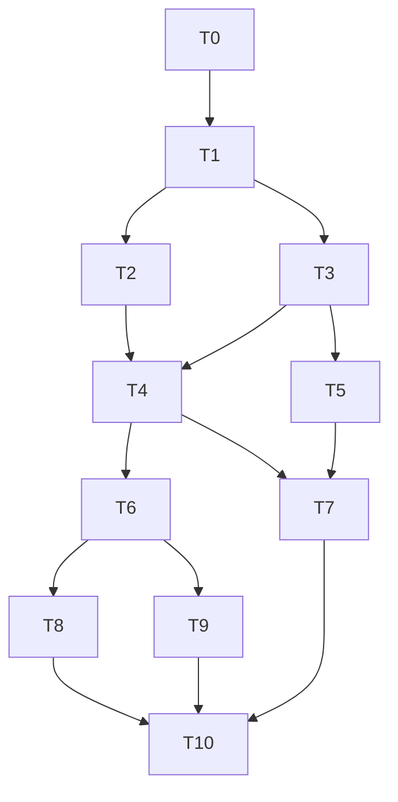

# Material Procurement and Signed-Contract Costs Implementation Plan

> **For agentic workers:** REQUIRED SUB-SKILL: Use superpowers:subagent-driven-development (recommended) or superpowers:executing-plans to implement this plan task-by-task. Steps use checkbox (`- [ ]`) syntax for tracking.

**Goal:** Xây flow phiếu kỹ sư -> mua hàng duyệt/tách đơn -> hợp đồng ký -> cam kết -> thực chi vật tư, dùng ledger canonical hiện có và không cần quản lý duyệt từng đợt cho flow mới.
**Architecture:** Module material-procurement riêng dùng project/business-party/evidence/RBAC có sẵn. Signed contract tạo direct authorization liên kết vào cost_workflow_installments/payments; dữ liệu cũ giữ lịch sử và chuyển quyền chi bằng explicit absorption, không tạo approval giả.
**Tech Stack:** Nuxt 4.3.1, Vue 3.5.28, TypeScript 5.9.3, Nuxt UI 4.4.0, Supabase/Postgres, decimal.js 10.6.0, Vitest 4.1.9, Playwright 1.61.1; Node 24.x / pnpm 10.29.3; không thêm dependency.
**Spec:** ../specs/2026-10-08-material-procurement-design.md
**Status:** Plan để review; các checkbox chưa chạy. Agent được phép cho planning; chưa thực thi code/migration.
**Code evidence:** origin/dev b00f0eb48effed49930f2aea6c090d77c2c175a5; feature trước tài liệu 1da87fe988a7300de58d206b65af6c14283d7d24.
**Scope decision:** Task hiện tại vật tư/hợp đồng ký. Bỏ duyệt đợt chi toàn bộ loại khác là follow-up F1; câu trả lời mới nhất loại nhân công nội bộ/khoản không hợp đồng khỏi task này.

## Global Constraints

- Giao diện và nghiệp vụ theo spec; purchasing không sửa proposal; engineer sửa draft/returned.
- Một proposal/line -> nhiều orders; một order -> một contract riêng.
- Tên trên báo giá và hóa đơn gắn NCC/material; canonical material không bị OCR/chứng từ ghi đè.
- Hợp đồng ký tăng cam kết; accountant-confirmed bank transfer với invoice+proof tăng actual cash.
- Canonical payments/consumptions; không ledger vật tư riêng, không dummy manager decisions.
- Source/tests/build remote tại /tmp/taskovia-site-engineer-material-request; controller dev và agy dev-preview được giữ nguyên.
- InstaCloud branch site-engineer-material-request là compute isolation; không coi Cloud DEV DB độc lập.
- Cloud DEV only; db:dev:* mutations chỉ sau explicit target/operation/SHA/run allowance. Không Local DB, production, reset/seed/repair.
- Forward-only migrations; filenames sinh bởi supabase migration new; không sửa applied migrations.
- Tối đa hai implementers đồng thời (ba slots tính cả integrator). Full build và Cloud DB jobs một lượt.
- Existing refund/correction/contract-adjustment policy nằm ngoài việc bỏ installment approval.
- Shared hooks, permission constants, package.json và generated types chỉ một owner ở từng thời điểm.

## Review Focus

1. Phiếu trả về sau khi một phần đã ký: unsigned order bị đình chỉ; signed identity/quantity không bị sửa hồi tố. Tests T4/T10.
2. Hai agent/user cùng phân bổ 20 thành 11+11 hoặc thanh toán quá cap: deterministic row/contract locks. Tests T2/T6/T10.
3. Retry sau timeout: cùng command/key/payload trả cùng identity; khác payload conflict; không cộng cam kết/notification/payment lần hai. Tests T3/T6/T9.
4. NCC dùng tên/quy cách/đơn vị khác hoặc invoice name đổi: mapping cần xác nhận, giữ occurrence/snapshot, không tự match sai. Tests T4/T8.
5. Legacy cap100/approved30/paid10: activate direct ->available90; legacy window không còn chi; lịch sử vẫn còn, không double rights/cash. Tests T6/T9/T10.

## Baseline và triển khai an toàn

- Verified setup ở feature 1da87fe: Node v24.17.0, pnpm10.29.3; build/typecheck/lint exit0.
- Unit setup run đã tách injected config: 2592 passed /36 failed, 11 files failed; thiếu .superpowers evidence và navigation/hash assertions. Đây là baseline cũ, không phải kết quả trên b00f0eb hay code tương lai.
- T0 phải rerun baseline sau sync. Không copy/fabricate snapshots, disable tests hoặc sửa unrelated code để làm xanh. Báo full-suite failures đúng; focused tests/regression touched phải xanh.
- Sync bằng merge reviewed dev vào feature, không reset/force push hoặc chỉnh agy. Không tự sync source trong bước lập plan hiện tại.
- Rollout vật tư được review riêng: old pending material requests không auto-approve; vật tư mới theo order/signed-contract source; loại ngoài scope giữ route/behavior.
- Shared-file changes vào một integration commit sau các agent; tránh agents đồng thời sửa CostRequestReviewPanel.vue đang được agy cập nhật.

## File ownership và API contracts

T1 sở hữu shared schemas/permissions, T2 migration vật tư, T6 corrective finance migrations/RPC. Integrator sở hữu shared app hooks: đăng ký repo/types ngay sau T3 trước T5, rồi navigation/bell/final hooks ở T9; agent không tự sửa các hooks này. Các migration chỉ được APPLY bởi T10 single operator.

Proposed server module: server/features/costs/material-procurement/{repository,service,routes}.ts.
Client: app/repositories/material-procurement.contracts.ts và http/http-material-procurement-repository.ts.
New UI: app/pages/materials/** và app/components/materials/**; dùng style/pattern có sẵn.

DTO decisions:
- ChosenSupplierInput: reuse createBusinessPartyInputSchema với partyKind=organization và confirmation supplierAlreadyChosen:true; không nhận tenant/company/actor từ form.
- MaterialProposalInput: neededOn, deliveryAddress, notes?, lines[{lineId,materialId,quantity}]; project/actor lấy từ route/session.
- ProposalDecisionInput: expectedVersion, decision approve|return, reason? (return bắt buộc).
- CreateMaterialOrderInput: approvedRevisionId, supplierId, currencyCode, unsignedQuotationEvidenceFileId, allocations[{proposalLineId,quantity,unitPrice,quotationMaterialName,mappingConfirmed}].
- CommitMaterialContractInput: expectedOrderVersion, contractReference, signedValue, currencyCode, signedContractEvidenceFileId, signedQuotationEvidenceFileId, documentsReviewed:true.
- CanonicalMaterialPaymentInput: giữ current amount/paymentDate/reference/currency/expectedVersion/evidenceFileIds; thêm explicit invoiceEvidenceFileId và invoiceNames[{orderLineId,name}]. Payment proof target vẫn canonical installment/window.
- Decimal strings numeric(20,4), không authoritative arithmetic bằng JS number.
- Proposed direct authority source: signed_contract; direct financial authorization table tham chiếu contract/order/evidence, không mở confirmed_supporting_basis trong task này.
- Evidence upload unsigned quote dùng target material_proposal + revision đã biết; signed hồ sơ dùng material_order; hóa đơn/proof đúng canonical financial target.
- Financial/report DTO thêm fields additive, không đổi nghĩa grossPaid/netCash hoặc phá legacy read.

Endpoint manifest:
- /api/companies/:companyId/material-procurement/projects GET
- /api/companies/:companyId/material-procurement/suppliers/resolve POST (NCC đã chốt; lookup/record, không sourcing)
- /api/companies/:companyId/material-procurement/materials GET|POST; /:materialId PATCH; /:materialId/supplier-names GET|POST
- /api/companies/:companyId/projects/:projectId/material-procurement/proposals GET|POST; /:proposalId GET|PATCH; /submit POST; /decisions POST
- .../proposals/:proposalId/orders POST; .../orders GET; .../orders/:orderId GET; .../orders/:orderId/contract POST
- .../material-procurement/evidence/upload-intents POST; /evidence/:fileId/finalize POST; /read-url POST
- Thanh toán reuse .../cost-workflow/installments/:installmentId/payments POST; không thêm endpoint ledger chi riêng.
- Thông báo reuse cost notification reader với source union và order link.

MaterialOrderView must contain id, version, proposalId, approvedRevisionId, supplierId, allocations, unsignedQuotationEvidenceFileId, contract (nullable; id/signedValue/currencyCode/authorizationId/installmentId) and cash {grossPaid,availableToPay}. MaterialProposalView contains id/version/reviewState/projectId/createdBy/neededOn/deliveryAddress/lines and order-progress derived values.
Server methods are scoped (scope, resourceId when needed, typed input, idempotencyKey) and validate scope from session. Client repository is bound to active company and accepts projectId/resourceId/input/key; it never accepts a forged actorId or tenantId from form.
Test fixtures T1 export validProposal, validLine, role scopes, split10Of20, quote11ForAllocation10, legacyOrder(cap100/approved30/paid10), signedContractInput and signed100Paid30. No fixture makes real Cloud calls.
Methods frozen in MaterialProcurementRepository:
listProjects/listMaterials/createMaterial/updateMaterial/listSupplierNames/recordSupplierName/resolveSupplier;
listProposals/readProposal/createProposal/updateProposal/submitProposal/decideProposal;
createOrder/listOrders/readOrder/recordContract; createEvidenceIntent/finalizeEvidence/readEvidenceUrl.
Commands nhận scope từ session, input typed và idempotencyKey; result {resourceId,version,replayed,reviewState?} (reviewState chỉ proposal commands), contract result thêm contractId/authorizationId/installmentId.

## Bảng chia task

| ID | Deliverable | Phụ thuộc | Có thể song song | Owner/model | Trạng thái |
|---|---|---|---|---|---|
| T0 | Đồng bộ nền, khóa spec và baseline | Không | Tuần tự | Integrator / Sol high | Chưa triển khai |
| T1 | Đóng băng DTO, API và permissions | T0 | Tuần tự | Core worker / Terra high | Chưa triển khai |
| T2 | Schema, RLS và RPC vật tư | T1 | Cùng T3 | DB worker / Terra high + DB review | Chưa triển khai |
| T3 | API và client cho danh mục, phiếu, xét duyệt | T1; tích hợp cần T2 | Cùng T2, dùng mocked RPC | Backend worker / Terra high | Chưa triển khai |
| T4 | Đơn mua, phân bổ và đối chiếu báo giá | T2,T3 | Cùng T5 | Backend worker / Terra high | Chưa triển khai |
| T5 | UI kỹ sư và danh mục | T1,T3 | Cùng T4 | UI worker / Terra high | Chưa triển khai |
| T6 | Hồ sơ ký, căn cứ chi trực tiếp và thực chi vật tư | T2,T4 | Cùng T7 | Finance worker / Terra high + deep review | Chưa triển khai |
| T7 | UI mua hàng: hộp phiếu, duyệt/trả, tách đơn | T1,T3,T4,T5 | Cùng T6 | UI worker / Terra high | Chưa triển khai |
| T8 | UI kế toán: hợp đồng, hóa đơn và chuyển khoản | T1,T4,T6 | Cùng T9 phần report; shared hooks tích hợp cuối | UI worker / Terra high | Chưa triển khai |
| T9 | Báo cáo, notification và tích hợp shared hooks | T6; integration đợi T5,T7,T8 | Report implementation cùng T8; hook merge tuần tự | Integrator / worker Terra high | Chưa triển khai |
| T10 | Review tích hợp, Cloud DEV rehearsal và acceptance preview | T2–T9 | Security và regression review có thể song song; DB/build/e2e deployment tuần tự | Integrator + 2 read-only reviewers; Cloud single operator | Chưa triển khai |

## Các đợt agent



| Đợt | Agent A | Agent B | Điều kiện |
|---|---|---|---|
| 0 | Integrator T0,T1 | — | Chốt spec/interfaces trước chia implementation |
| 1 | T2 DB/RPC vật tư | T3 server/client | T3 test bằng mocked RPC; không apply DB |
| 2 | T4 orders/quotation | T5 engineer UI | DTO frozen; tách server và UI files |
| 3 | T6 signed contract/cash | T7 purchasing UI | T7 dùng mocked contract result; finance reviewer gate |
| 4 | T8 accounting UI | T9 report/notification | Report contract đã frozen; T9 hook integration đợi UI |
| 5 | Security/DB read-only review | Regression/UI read-only review | Cùng immutable integrated SHA; không sửa file |
| 6 | Integrator T10 Cloud/preview | — | Authorization packet riêng, DB/build/deploy tuần tự |

Không chạy song song: T0/T1 schema contract decisions; edits shared constants/hooks/package; migration APPLY/type generation; full build; tests dùng chung Cloud fixtures; same-row money/quantity fixture runs; promotion/merge/deploy.

## Bàn giao cho agent

- Mỗi implementation agent có remote Git worktree/branch riêng từ cùng executionBaseSha, trong branch InstaCloud task đã có. Không branch switch trên shared checkout.
- Native app worktree local không thay remote workflow; remote worktrees thực hiện bằng cơ chế phù hợp trên worker.
- Không tạo thêm InstaCloud branches/services nếu không cần; không coi worktree/compute isolation là DB isolation.
- Brief chỉ gồm spec requirements của task, exact interfaces/files, acceptance commands, dependencies và scope. fork_turns=none.
- Bounded implementer: worker (GPT-5.6 Terra high); parent integrator/planner GPT-5.6 Sol high theo working agreement.
- Xhigh/deep_worker chỉ khi task high chưa xử lý được hoặc financial debugging thật sự liên quan nhiều subsystem. Financial design có deep_planner review.
- Mỗi task tự review + scoped reviewer gate. Chỉ integrator merge/cherry-pick reviewed commits; không agents tự push dev/main.
- Báo cáo mỗi agent: task ID; base/head SHA; changed files; commands thật chạy/exit; invariant proved vs unverified; remaining risk; handoff.
- Tất cả current workers trong lập plan là read-only, không được tự suy ra authorization implementation/Cloud mutation.

## Chi tiết task

### T0: Đồng bộ nền, khóa spec và baseline

**Owner / dependency:** Integrator / Sol high; Không.
**Files:** Modify docs của task; không reset/rewrite published history.
**Interfaces:** Chốt executionBaseSha, task-head, endpoint/type manifest, file-owner map và danh sách baseline failures.

- [ ] Viết/khóa test: `git merge-base + rev-list; records 4 upstream commits tại mốc b00f0eb. Rerun baseline sau đồng bộ; không gọi 36 lỗi cũ là pass.`.
- [ ] Chạy RED hoặc baseline và xác nhận thất bại đúng nguyên nhân; không dùng SQL mutation khi chưa được phép.
- [ ] Thực hiện: Merge reviewed dev vào nhánh task ở remote worktree khi bắt đầu thực thi; giữ các commit tài liệu. Đọc lại AGENTS và dirty tree trước merge. Không chạm parent dev-preview.
- [ ] Verify: `env -u TASKOVIA_DEV_CONFIG_SOURCE -u SUPABASE_DEV_ACCESS_TOKEN -u NUXT_PUBLIC_SUPABASE_URL -u NUXT_PUBLIC_SUPABASE_ANON_KEY pnpm test:unit; pnpm typecheck; pnpm lint; pnpm build`. Chỉ báo pass khi command đó thực chạy thành công trên tree tương ứng.
- [ ] Review đúng phạm vi; commit riêng các file task, ghi SHA và bàn giao. Không commit file của agent khác.

**Done:** Có SHA nền chính xác và baseline ledger; lỗi cũ được phân loại, không sửa/disable ngoài task.

### T1: Đóng băng DTO, API và permissions

**Owner / dependency:** Core worker / Terra high; T0.
**Files:** Create shared/schemas/costs/material-procurement.ts; shared/schemas/costs/direct-contract-authority.ts; tests/unit/material-procurement/fixtures.ts; tests/unit/shared/material-procurement.spec.ts. Modify shared/constants/permissions.ts.
**Interfaces:** MaterialProposalInput/View, ProposalDecisionInput, CreateMaterialOrderInput/View, CommitMaterialContractInput, MaterialCommandResult, MaterialQuotationComparisonInput/View; DirectContractAuthorityView; CanonicalMaterialPaymentInput; MaterialProcurementRepository.

- [ ] Viết/khóa test: `expect(materialProposalInputSchema.safeParse({...validProposal, lines:[{...validLine, quantity:'0'}]}).success).toBe(false); expect(materialProposalDecisionInputSchema.safeParse({decision:'return',reason:''}).success).toBe(false)`.
- [ ] Chạy RED hoặc baseline và xác nhận thất bại đúng nguyên nhân; không dùng SQL mutation khi chưa được phép.
- [ ] Thực hiện: Khóa enums, property names, decimal strings, expectedVersion/key và endpoint manifest bên dưới. Permissions mới: material.read, material.manage, material.proposal.submit, material.proposal.decide, material.order.manage, material.supplier.record, material.contract.record. Reuse cost.record_cash và cost.notification.read. Buyer không có proposal-update permission; role grants nằm trong authorized rollout packet, không auto grant cho mọi nhân viên.
- [ ] Verify: `pnpm exec vitest run tests/unit/shared/material-procurement.spec.ts`. Chỉ báo pass khi command đó thực chạy thành công trên tree tương ứng.
- [ ] Review đúng phạm vi; commit riêng các file task, ghi SHA và bàn giao. Không commit file của agent khác.

**Done:** Schema tests pass; interfaces được review trước khi chia agent; chỉ integrator thay contracts sau mốc này.

### T2: Schema, RLS và RPC vật tư

**Owner / dependency:** DB worker / Terra high + DB review; T1.
**Files:** Create new migrations bằng supabase migration new c1_material_procurement_foundation / security / commands; supabase/tests/database/c1/c1_material_procurement.test.sql; supabase/tests/database/c1/c1_material_procurement_security.test.sql; tests/unit/config/c1-material-procurement-guard.spec.ts.
**Interfaces:** Tables material_items, material_supplier_names, material_proposals, proposal revisions/lines, decisions, orders/allocations/order_contract links. RPC c1_material_record_supplier, create_proposal, update_proposal, submit_proposal, decide_proposal, create_order; scoped tenant/company/project.

- [ ] Viết/khóa test: `SQL fixture phải chứng minh buyer update -> PERMISSION_DENIED; 20 ->10+10 OK; 20 ->11+10 và hai concurrent 11 bị chặn; stale revision -> VERSION_CONFLICT. Static guard unit pins the forward-only RPC/constraint manifest, không thay thế SQL execution.`.
- [ ] Chạy RED hoặc baseline và xác nhận thất bại đúng nguyên nhân; không dùng SQL mutation khi chưa được phép.
- [ ] Thực hiện: Snapshot immutable; stable line identity; deterministic locks; direct-table DML deny; composite FKs; bind quote PDF to proposal/revision trước khi order tồn tại. T2 chỉ sở hữu các migration vật tư; finance migration thuộc T6 sau T2.
- [ ] Verify: `pnpm exec vitest run tests/unit/config/c1-material-procurement-guard.spec.ts; SQL suites chỉ chạy tại T10 sau Cloud authorization`. Chỉ báo pass khi command đó thực chạy thành công trên tree tương ứng.
- [ ] Review đúng phạm vi; commit riêng các file task, ghi SHA và bàn giao. Không commit file của agent khác.

**Done:** DDL/RPC reviewed + guard tests pass; đánh dấu invariants Cloud chưa xác minh cho đến T10.

### T3: API và client cho danh mục, phiếu, xét duyệt

**Owner / dependency:** Backend worker / Terra high; T1; tích hợp cần T2.
**Files:** Create server/features/costs/material-procurement/{repository,service,routes}.ts; route files theo endpoint manifest; app/repositories/material-procurement.contracts.ts; app/repositories/http/http-material-procurement-repository.ts. Tests tests/unit/server/material-proposals.spec.ts; tests/unit/repositories/http-material-procurement-repository.spec.ts.
**Interfaces:** Repository listMaterials/listProjects/resolveSupplier/createProposal/updateProposal/submitProposal/decideProposal; commands (scope,input,idempotencyKey) -> MaterialCommandResult.

- [ ] Viết/khóa test: `await expect(service.updateProposal(buyerScope, proposal.id, revised, key)).rejects.toMatchObject({statusCode:403}); expect(await service.submitProposal(engineerScope, returned.id, currentVersion, key)).toMatchObject({state:'submitted'}); wrong-company ->403/404; stale version ->409.`.
- [ ] Chạy RED hoặc baseline và xác nhận thất bại đúng nguyên nhân; không dùng SQL mutation khi chưa được phép.
- [ ] Thực hiện: Reuse projects.locationText, business_parties, existing HTTP/error/retry patterns. Creator identity từ auth. Purchase decisions không gọi manager financial RPC. Supplier resolve endpoint nhận thông tin NCC đã chốt từ người mua/PDF; lookup để tránh bản ghi trùng và record organization trong business_parties bằng material.supplier.record. Không directory đề xuất NCC, không grant cost.prepare/cost.party.* rộng cho mua hàng.
- [ ] Verify: `pnpm exec vitest run tests/unit/server/material-proposals.spec.ts tests/unit/repositories/http-material-procurement-repository.spec.ts`. Chỉ báo pass khi command đó thực chạy thành công trên tree tương ứng.
- [ ] Review đúng phạm vi; commit riêng các file task, ghi SHA và bàn giao. Không commit file của agent khác.

**Done:** RBAC/version/idempotency tests pass; adapters compile với DTO frozen; không cần Cloud để test mocks. Integrator đăng ký repository/type hooks sau review T3 trước khi T5 bắt đầu.

### T4: Đơn mua, phân bổ và đối chiếu báo giá

**Owner / dependency:** Backend worker / Terra high; T2,T3.
**Files:** Extend server/features/costs/material-procurement and its client repository; Create shared/utils/material-quotation-comparison.ts; tests/unit/material-procurement/quotation-comparison.spec.ts; tests/unit/server/material-orders.spec.ts.
**Interfaces:** createOrder/listOrders/readOrder; reconcileMaterialQuotation(input: MaterialQuotationComparisonInput) -> MaterialQuotationComparisonView; allocation identity = proposalLineId + approvedRevisionId + orderLineId.

- [ ] Viết/khóa test: `expect(reconcileMaterialQuotation(split10Of20)).toMatchObject({status:'matched',allocatedQuantity:'10.0000'}); expect(reconcileMaterialQuotation(quote11ForAllocation10).status).toBe('mismatch'); signed10 + proposedQuantity8 -> conflict.`.
- [ ] Chạy RED hoặc baseline và xác nhận thất bại đúng nguyên nhân; không dùng SQL mutation khi chưa được phép.
- [ ] Thực hiện: Dùng decimal.js và RPC authoritative locks. Lưu PDF unsigned qua evidence scope mới; dữ liệu đối chiếu xác nhận bởi mua hàng. Không tự sửa phiếu; trả phiếu đình chỉ unsigned orders, giữ signed allocations. Không tạo OCR/parser mới; reuse existing reviewed extraction nếu tích hợp được an toàn.
- [ ] Verify: `pnpm exec vitest run tests/unit/material-procurement/quotation-comparison.spec.ts tests/unit/server/material-orders.spec.ts`. Chỉ báo pass khi command đó thực chạy thành công trên tree tương ứng.
- [ ] Review đúng phạm vi; commit riêng các file task, ghi SHA và bàn giao. Không commit file của agent khác.

**Done:** Case 20->10A+10B đúng, quantity/spec mismatch hiển thị, buyer không sửa proposal, retries không tạo đơn trùng.

### T5: UI kỹ sư và danh mục

**Owner / dependency:** UI worker / Terra high; T1,T3.
**Files:** Create app/pages/materials/index.vue; app/pages/materials/[projectId]/proposals/{index,new,[proposalId]}.vue; app/components/materials/MaterialMasterPanel.vue; MaterialProposalForm.vue; tests/e2e/material-proposal.spec.ts.
**Interfaces:** Dùng MaterialProcurementRepository frozen; mocked HTTP fixtures cho vòng form trong khi T4 đang chạy; shared navigation/plugin hooks thuộc T9.

- [ ] Viết/khóa test: `await expect(page.getByLabel('Nơi giao')).toHaveValue(projectAddress); edit deliveryAddress -> original project unchanged; buyer cannot see/edit form; engineer return->edit->resubmit -> fresh submitted DOM.`.
- [ ] Chạy RED hoặc baseline và xác nhận thất bại đúng nguyên nhân; không dùng SQL mutation khi chưa được phép.
- [ ] Thực hiện: Tuân style Nuxt UI hiện có, native inputs; không package mới. Phiếu chưa có supplier/price/invoice requirement. Lưu stable lineId; hiển thị error/409 và retry key đúng payload.
- [ ] Verify: `PLAYWRIGHT_PORT=4321 pnpm exec playwright test tests/e2e/material-proposal.spec.ts --project=chromium`. Chỉ báo pass khi command đó thực chạy thành công trên tree tương ứng.
- [ ] Review đúng phạm vi; commit riêng các file task, ghi SHA và bàn giao. Không commit file của agent khác.

**Done:** Mocked E2E pass địa chỉ default/edit, role form, returned resubmission; không seed Cloud.

### T6: Hồ sơ ký, căn cứ chi trực tiếp và thực chi vật tư

**Owner / dependency:** Finance worker / Terra high + deep review; T2,T4.
**Files:** Create fresh forward migrations c1_material_contract_authority / cash_compatibility; server/features/costs/workflow/direct-contract-authority.{repository,service}.ts; tests/unit/server/direct-contract-authority.spec.ts; supabase/tests/database/c1/c1_direct_contract_authority.test.sql. Modify cost-workflow-cash.service.ts, canonical cash RPC via corrective migration, evidence source/target support.
**Interfaces:** recordMaterialContract(scope,orderId,CommitMaterialContractInput,key) -> {contractId,authorizationId,installmentId,notificationId,replayed}; confirmPayment remains canonical installment payment endpoint; direct_contract source has no manager decision.

- [ ] Viết/khóa test: `await recordMaterialContract(scope, legacyOrder.id, signedContractInput, key); expect((await readOrder(scope, legacyOrder.id)).cash.availableToPay).toBe('90.0000'); old window post after absorption -> conflict; missing signed quote/invoice/proof or buyer cash ->deny; direct material cash succeeds without project manager assignment; refund20 does not restore consumption; concurrent payments above100 fail.`.
- [ ] Chạy RED hoặc baseline và xác nhận thất bại đúng nguyên nhân; không dùng SQL mutation khi chưa được phép.
- [ ] Thực hiện: Reuse cost_workflow_contracts/payments/consumptions. Add immutable direct signed-contract authorization; exact source union for legacy vs direct, nullable legacy-only references with CHECK constraints, no dummy approval. Material order one-to-one contract; docs finalized/scope/hash checks; new direct payments no manager nor cost.request.submit prerequisite, scoped to direct source. Non-material and refund/correction rules unchanged. Existing material contract activation absorbs old windows, carries historical consumption, prevents double capacity.
- [ ] Verify: `pnpm exec vitest run tests/unit/server/direct-contract-authority.spec.ts tests/unit/server/cost-workflow-cash.spec.ts tests/unit/server/cost-workflow-contract-version.spec.ts; Cloud SQL/concurrency at T10 only`. Chỉ báo pass khi command đó thực chạy thành công trên tree tương ứng.
- [ ] Review đúng phạm vi; commit riêng các file task, ghi SHA và bàn giao. Không commit file của agent khác.

**Done:** Unit/regression reviewed; legacy history preserved; all new material cash goes through canonical ledger; Cloud invariants not claimed before T10.

### T7: UI mua hàng: hộp phiếu, duyệt/trả, tách đơn

**Owner / dependency:** UI worker / Terra high; T1,T3,T4,T5.
**Files:** Create app/components/materials/MaterialProposalDecisionPanel.vue; MaterialOrderCreatePanel.vue; MaterialQuotationComparisonPanel.vue; purchasing views under app/pages/materials/[projectId]/proposals; tests/e2e/material-purchasing.spec.ts.
**Interfaces:** Dùng decideProposal/createOrder/readOrder; không updateProposal ở buyer screen; các đoạn proposal UI dùng shared readonly view từ T5 sau integration.

- [ ] Viết/khóa test: `approve -> create10A+10B -> remaining0; 11+10 ->error; return without reason ->blocked; raw supplier name mapping not confirmed ->mismatch; buyer cannot PATCH proposal even if forged UI request.`.
- [ ] Chạy RED hoặc baseline và xác nhận thất bại đúng nguyên nhân; không dùng SQL mutation khi chưa được phép.
- [ ] Thực hiện: Only buyer views mới; không sửa CostRequestReviewPanel agy đang làm. Hiển thị allocated/remaining per line, split order quotations and comparison; POST -> canonical GET -> fresh DOM.
- [ ] Verify: `PLAYWRIGHT_PORT=4322 pnpm exec playwright test tests/e2e/material-purchasing.spec.ts --project=chromium`. Chỉ báo pass khi command đó thực chạy thành công trên tree tương ứng.
- [ ] Review đúng phạm vi; commit riêng các file task, ghi SHA và bàn giao. Không commit file của agent khác.

**Done:** Mocked browser scenarios pass; APIs real tích hợp tại T9/T10; readonly engineer fields enforced server-side.

### T8: UI kế toán: hợp đồng, hóa đơn và chuyển khoản

**Owner / dependency:** UI worker / Terra high; T1,T4,T6.
**Files:** Create app/pages/materials/[projectId]/orders/{index,[orderId]}.vue; MaterialContractRecordPanel.vue; MaterialOrderPaymentPanel.vue; tests/e2e/material-contract-payment.spec.ts. Reuse CostInstallmentPaymentModal only through reviewed minimal adapter if its contract fits.
**Interfaces:** Order signed command returns canonical installmentId; existing canonical confirmPayment with invoice+proof and invoiceNames mapping; no new material-only payment ledger/endpoint.

- [ ] Viết/khóa test: `signed100 -> commitment100/paid0; pay30 with invoice+proof ->paid30; missing either ->blocked; retry ->same paymentId; no manager-assignment UI/gate for direct source.`.
- [ ] Chạy RED hoặc baseline và xác nhận thất bại đúng nguyên nhân; không dùng SQL mutation khi chưa được phép.
- [ ] Thực hiện: Contract formed offline; upload both signed PDFs and confirm reviewed signed value. Capture supplier-specific invoice names at actual invoice. Actor remains accountant; quantities and paid figures come from canonical GET.
- [ ] Verify: `PLAYWRIGHT_PORT=4323 pnpm exec playwright test tests/e2e/material-contract-payment.spec.ts --project=chromium`. Chỉ báo pass khi command đó thực chạy thành công trên tree tương ứng.
- [ ] Review đúng phạm vi; commit riêng các file task, ghi SHA và bàn giao. Không commit file của agent khác.

**Done:** Mocked accountant flow passes, files/new forms isolated from T7; legacy accounting UI not overwritten.

### T9: Báo cáo, notification và tích hợp shared hooks

**Owner / dependency:** Integrator / worker Terra high; T6; integration đợi T5,T7,T8.
**Files:** Modify shared/schemas/costs/cost-workflow-reporting.ts; server/features/costs/finance/cost-workflow-summary.ts; cost-workflow-money.ts; notification routing; app finance display. Sole owner app/repositories/contracts.ts, app/plugins/repositories.client.ts, app/components/app/navigation-permissions.ts, app/layouts/default.vue, package.json và generated types. Tests tests/unit/server/material-commitment-summary.spec.ts; tests/unit/repositories/cost-workflow-notification-links.spec.ts.
**Interfaces:** summarizeMaterialCommitments(input: MaterialCommitmentFacts) -> MaterialCommitmentSummary; committedMaterialCost + materialCommitmentRemaining + canonical grossPaid/netCash; notification source union manager_decision | material_signed_contract; order deep-link for new source.

- [ ] Viết/khóa test: `expect(summarizeMaterialCommitments(signed100Paid30)).toMatchObject({committedMaterialCost:'100.0000',grossPaid:'30.0000',materialCommitmentRemaining:'70.0000'}); repeated doc save ->one event/notification; absorbed legacy window not active approvedUnspent; no double imported commitment.`.
- [ ] Chạy RED hoặc baseline và xác nhận thất bại đúng nguyên nhân; không dùng SQL mutation khi chưa được phép.
- [ ] Thực hiện: Additive reporting, preserve currency grouping/coverage and historical meaning. UI label cam kết vật tư, không giả total all categories. Integrator registered repo/types at checkpoint after T3; registers navigation/bell/final hooks after agent files pass, reviews all generated outputs.
- [ ] Verify: `pnpm exec vitest run tests/unit/server/material-commitment-summary.spec.ts tests/unit/repositories/cost-workflow-notification-links.spec.ts; pnpm typecheck; pnpm lint; pnpm build`. Chỉ báo pass khi command đó thực chạy thành công trên tree tương ứng.
- [ ] Review đúng phạm vi; commit riêng các file task, ghi SHA và bàn giao. Không commit file của agent khác.

**Done:** Totals/notification/old links correct; all shared hooks integrated by one owner; source diff scope reviewed.

### T10: Review tích hợp, Cloud DEV rehearsal và acceptance preview

**Owner / dependency:** Integrator + 2 read-only reviewers; Cloud single operator; T2–T9.
**Files:** Create tests/e2e/material-procurement-flow.spec.ts; tests/unit/config/material-procurement-cloud-guard.spec.ts; scripts/run-c1-material-procurement-tests.mjs / concurrency.mjs; package hooks do T9/integrator own; docs/server/material-procurement.md; generated shared/types/database.types.ts only after authorized db:dev:types.
**Interfaces:** Guarded db:dev:c1:material-procurement:test / concurrency commands introduced here and registered by integrator, not existing commands today. Acceptance uses exact artifact SHAs.

- [ ] Viết/khóa test: `Full path engineer->return->resubmit->approve->20 split10/10->two signed contracts->two commitments->partial bank payments. Two-company negative RLS; concurrent over-allocation/cash; duplicate proofs/retries; wrong revision/file target; signed-row mutation; legacy absorption.`.
- [ ] Chạy RED hoặc baseline và xác nhận thất bại đúng nguyên nhân; không dùng SQL mutation khi chưa được phép.
- [ ] Thực hiện: Run focused tests then regression baseline diff. Ask for exact Cloud DEV target/commands/run allowance only after code and dry review are concrete. No Local DB fallback. One operator applies migrations, types and DB tests; stop at first cloud failure. Manual deployment only to new branch preview, never agy dev-preview or Production.
- [ ] Verify: `Focused unit + mocked E2E -> pnpm typecheck/lint/build; future authorized pnpm db:dev:target/dry-run/push/types and new guarded SQL/concurrency commands; final branch preview smoke`. Chỉ báo pass khi command đó thực chạy thành công trên tree tương ứng.
- [ ] Review đúng phạm vi; commit riêng các file task, ghi SHA và bàn giao. Không commit file của agent khác.

**Done:** Review findings closed, tests actually run/results recorded, Cloud allowance consumed recorded, migrations parity/types diff reviewed, live evidence captured; otherwise report blocked/pending, never claim complete.


## Verification và Cloud packet

Unit command pattern (remote):
```sh
env -u TASKOVIA_DEV_CONFIG_SOURCE -u SUPABASE_DEV_ACCESS_TOKEN -u NUXT_PUBLIC_SUPABASE_URL -u NUXT_PUBLIC_SUPABASE_ANON_KEY pnpm exec vitest run <task-tests>
```
Đã xác minh playwright.config.ts tại b00f0eb có project chromium; T0 kiểm tra lại nếu execution base thay đổi; mocked browser tests dùng tests/e2e/fixtures/authenticated.ts và existing auth-routes.ts. Mỗi job cần port riêng qua PLAYWRIGHT_PORT; build/E2E full chạy serial.

Cloud packet T10 phải ghi project ref Cloud DEV, exact execution/head SHA, migration list/order, command allowlist, fixture scope, run/retry allowance và stop-at-first-failure.
package.json là command source of truth. db:dev:c1:material-procurement:test/concurrency hiện chưa có; T10/T9 bổ sung wrapper dùng existing DEV target guard, không kết nối Local DB.
db:dev:types có thể sửa shared/types/database.types.ts: integrator review diff. Không gọi verify:dev sớm nếu chưa được phép generated types/Cloud operations.
Migration push, SQL/RLS/concurrency acceptance và fixture mutations không được suy ra từ việc người dùng cho dùng agent hoặc duyệt plan.
Preview final chỉ nhánh site-engineer-material-request, manual Git source; kết quả build/live/HTTP cần chứng cứ thực tế trên final SHA.
Completion report phải tách source/unit, SQL invariants và live behavior, không gọi task complete khi gate required chưa chạy.

## Follow-up ngoài task

F1: Áp dụng quyết định bỏ manager installment approval cho nhân công, máy móc/thầu phụ/chi phí khác ngoài luồng vật tư của task; chốt căn cứ cho khoản không có hợp đồng và không có hóa đơn trước implementation.
F2: Kho/giao nhận hoặc phân bổ một bank transfer qua nhiều hợp đồng chỉ thêm khi có yêu cầu riêng.
Không đánh dấu F1/F2 đã thực hiện.

## Bảng báo cáo khi thực thi

| Task | Owner | Base/head SHA | Tests/exit | Scope diff | Review | Cloud allowance | State/blocker |
|---|---|---|---|---|---|---|---|
| T0–T10 | Theo assignment thực tế | Bắt buộc điền | Command thật + result | File ownership | Pass/findings | Chưa dùng/consumed count | Chưa bắt đầu/đang chạy/blocked/done |

## Self-review của plan

- Mọi requirement spec mục 2–8 có owner ở T1–T9, live safety verification ở T10.
- Finance direct-source branch dùng canonical cash và giữ lịch sử; invoices/target proofs/caps có tests.
- Mua hàng không sửa proposal; split quantities/revisions/signed allocations có coverage.
- Owner duy nhất cho shared hooks/migrations apply; schedule không chạy 3 implementers khi runtime chỉ có 3 slots kể cả root.
- Baseline 36 lỗi cũ và Cloud gate được ghi đúng; không có claim tests mới đã pass.
- Project Playwright chromium đã được đối chiếu với config tại b00f0eb; migration filenames luôn từ CLI, không có timestamp bịa.
