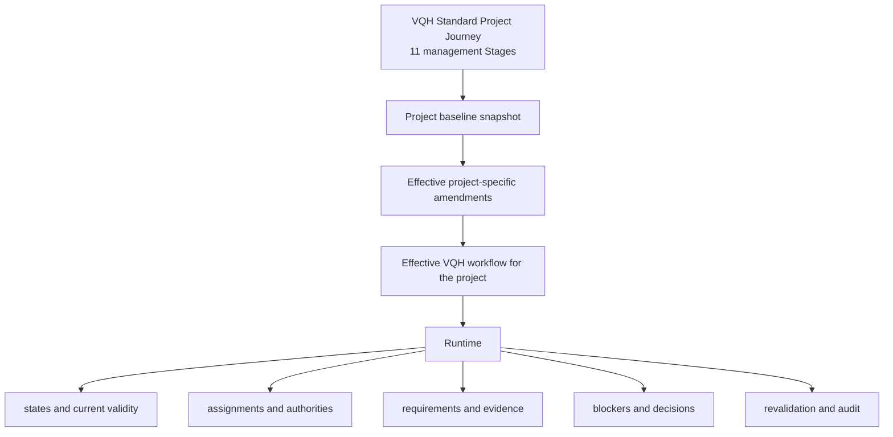
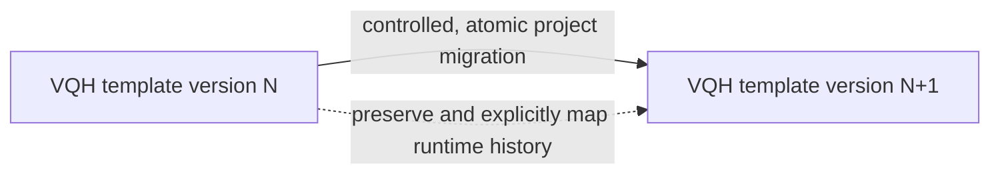

# VQH Project Journey

> **Status:** Canonical VQH Project Journey Reference
>
> **Authority scope:** VQH Project Journey only
>
> **Design maturity:** DISCOVERY / ARCHITECTURE BASELINE — NOT IMPLEMENTATION SPEC
>
> **Primary audience:** developers, coding/AI agents, technical leads, project handover owners, and VQH management
>
> **Last reviewed against repository:** 2026-08-29

## 1. Purpose

This document is the canonical entry point for answering:

> VQH vận hành một project trên Taskovia như thế nào?

It maps the confirmed VQH project lifecycle, the shared workflow semantics used across that lifecycle, the governance boundaries that implementations must preserve, and the documents to read before changing a Stage.

This README is an overview and navigation reference. It does not attempt to contain the full business design of all 11 Stages. A Stage-specific document is created only after that Stage has completed discovery/design and received approval.

Confirmed decisions in this document are the business baseline for future VQH Project Journey work. Prototype behavior is evidence about the current implementation, not authority to silently redefine that baseline.

Canonical authority does not mean the entire VQH Project Journey is fully designed or implementation-ready. This reference distinguishes three maturity states:

| Maturity state | Meaning |
| --- | --- |
| `CONFIRMED` | Source of truth for currently approved VQH workflow behavior; implementations must preserve it. |
| `UNRESOLVED` | Discovery, design, and approval are still required before implementation; an implementation must not fill the gap by assumption. |
| `SUPERSEDED` | A historical decision retained after an approved replacement, with its replacement and rationale recorded. |

The canonical authority of `CONFIRMED` decisions remains binding even while other parts of the Journey are `UNRESOLVED`.

## 2. Scope and boundary

The rules in this document apply only to the VQH Project Journey.

```text
Taskovia Platform
        │
        ├── generic technical/platform capabilities
        │
        └── company-specific workflows
                 │
                 └── VQH
                      └── Project Journey
```

Taskovia is a multi-company platform. It provides capabilities from which a company-specific workflow can be implemented. This reference does not require another company to share VQH's:

- Stage structure;
- state model;
- requirement model;
- dependency, reopen, or revalidation rules;
- applicability rules;
- amendment or migration rules;
- ownership, approval, or completion governance.

Use formulations such as:

> VQH Project Journey requires controlled reopen semantics. A Taskovia implementation supporting VQH must preserve those semantics.

Do not generalize that statement into a universal Taskovia workflow law.

## 3. How to use this documentation

Read this README before changing any VQH Project Journey workflow behavior. Then read the approved Stage-specific document if one exists for the affected Stage.

The authority hierarchy for VQH business workflow decisions is:

```text
VQH Project Journey — Canonical Reference
                ↓
Approved Stage Design
                ↓
Technical / Implementation Spec
                ↓
Implementation Plan
                ↓
Code
```

A lower-level specification or implementation does not override a confirmed VQH business decision. When code and approved VQH workflow documentation differ:

1. report the divergence;
2. do not silently treat the code as business truth;
3. determine which confirmed decisions and upstream/downstream contracts are affected;
4. update approved workflow documentation before, or together with, an approved business design change;
5. preserve the rationale and history of superseded decisions.

The current Stage-specific directory is intentionally absent. Future approved documents belong under `docs/vqh/project-journey/stages/` and must follow the contract in [Section 18](#18-stage-documentation-contract).

## 4. Repository analysis baseline

| Field | Value |
| --- | --- |
| Repository | `Sonos18/company-operations-platform` |
| Branch | `main` |
| Immutable analysis SHA | `35ae01cf80a3a3b1a25567a6e49b89c3888443b5` |
| Analysis date | `2026-08-29` |

The analysis included the current journey types, presenter, composable, mock fixtures and schemas, repository contracts, project/journey UI, journey tests, VQH company configuration, root architecture/prototype README, and existing approved Project Journey design documents.

Important source anchors include:

- `app/features/journey/journey.types.ts`;
- `app/features/journey/journey.presenter.ts`;
- `app/composables/useProjectJourney.ts`;
- `app/repositories/mock/fixtures.ts`;
- `app/repositories/mock/schemas.ts`;
- `app/config/prototype.ts`;
- `app/config/companies/vqh.company.ts`;
- `app/components/journey/`;
- `app/pages/projects/[projectId]/`;
- `docs/superpowers/specs/*project-journey*.md`.

The repository at this SHA is still a browser-backed prototype for Project Journey business data. Its behavior is summarized, but not promoted to confirmed VQH policy, in [Section 20](#20-current-implementation-status).

## 5. VQH Project Lifecycle overview

VQH currently uses one standard 11-Stage lifecycle template. Project-specific applicability is handled through controlled `not_applicable` semantics and other approved governance mechanisms, not by creating separate lifecycle templates early for design-only, construction-only, renovation, interior, or similar variations (VQH-WF-001).

The 11 top-level Stages are management Stages. Detailed technical work items such as MEP, xây tô, sơn, ốp lát, or another construction package do not automatically become top-level Stages.



Definition and runtime are separate concerns:

- **Definition** describes nodes, dependencies, requirements, governance rules, owner rules, completion rules, and applicability rules.
- **Runtime** records what happened for one project: state transitions, assignments, submissions, decisions, blockers, revalidation, and audit history.

The effective workflow is:

```text
Project baseline snapshot
+ approved effective project-specific amendments
= effective VQH workflow for that project
```

## 6. The 11 management Stages

| No. | Confirmed management Stage | Management meaning at overview level |
| --- | --- | --- |
| 01 | Tiếp nhận & đánh giá cơ hội | Capture and evaluate the opportunity, then record the controlled decision to proceed or not proceed. |
| 02 | Khảo sát hiện trạng | Govern the current-state survey phase. Detailed inputs, gates, and outputs remain to be designed. |
| 03 | Thiết kế phương án | Govern development of the proposed design direction. Detailed requirements remain to be designed. |
| 04 | Thiết kế kỹ thuật & hồ sơ thi công | Govern technical design and construction-document preparation. Detailed requirements remain to be designed. |
| 05 | Báo giá & hợp đồng thi công | Govern quotation and construction-contract work. Detailed requirements remain to be designed. |
| 06 | Chuẩn bị thi công | Govern construction readiness. Detailed start and exit criteria remain to be designed. |
| 07 | Thi công phần thô | Govern rough-construction execution at management level. Technical work packages remain below the top-level Stage. |
| 08 | Thi công hoàn thiện | Govern finishing execution at management level. Technical work packages remain below the top-level Stage. |
| 09 | Nghiệm thu & xử lý tồn tại | Govern inspection, acceptance, and resolution of outstanding items. Detailed rules remain to be designed. |
| 10 | Bàn giao & quyết toán | Govern handover and final-account work. Detailed rules remain to be designed. |
| 11 | Bảo hành | Govern the project warranty phase. Detailed rules remain to be designed. |

This table confirms the Stage names and their management-level boundaries. It does not invent Stage 02–11 sub-stages, requirements, authorities, dependency edges, or exit criteria.

## 7. Shared VQH workflow semantics

### 7.1 Explicit dependency graph

VQH workflow is not hard-coded as `01 → 02 → 03 → ...`. Each workflow node declares its dependencies. Independent nodes may run in parallel. Stage and Sub-stage use the same dependency semantics (VQH-WF-003).

A dependency is satisfied only by a valid upstream result under its declared rule. In particular:

- `blocked != completed`;
- a blocked node does not unlock downstream work;
- VQH v1 does not treat `active` as sufficient to satisfy a dependency (VQH-WF-006);
- `not_applicable` satisfies a dependency only when that edge explicitly allows it (VQH-WF-026).

### 7.2 Generic recursive workflow node

Stage and Sub-stage must not be modeled as two independent workflow engines. The conceptual model is recursive (VQH-WF-004):

```text
WorkflowNode
- id
- parentNodeId
- level/type
- dependencies
- requirements
- governance/completion rules
- runtime state
```

The first UI may expose only:

```text
Stage
└── Sub-stage
```

The conceptual model must not unnecessarily prevent a future level such as a work package. This reference does not prescribe a database schema or decide the unresolved parent/child mechanics listed in [Section 22](#22-open--intentionally-unresolved).

### 7.3 Node states

The confirmed VQH node states are (VQH-WF-005):

| State | Meaning |
| --- | --- |
| `locked` | Declared dependencies have not been satisfied. |
| `ready` | Dependencies are satisfied and the node can be prepared for an explicit start. |
| `active` | The node has been explicitly started. |
| `blocked` | The node has started and at least one effective blocking blocker is open. |
| `completed` | The node has been validly completed. |
| `not_applicable` | The node does not apply to this project under controlled applicability governance. |

State is not the same as business outcome. For example, Stage 01 may be `completed` with either `proceed` or `not_proceeding` as its business outcome (VQH-S01-002).

## 8. Requirement and hard-gate model

### 8.1 Hard gates and generic requirements

VQH workflow is not advisory-only. A required applicable requirement that is not fulfilled can prevent completion and progression/unlock (VQH-WF-002).

A `WorkflowRequirement` is generic and may represent a record, checklist, approval, confirmation, or another approved requirement type. It is not hard-coded to a document or file (VQH-WF-007). Examples explain the concept; they are not automatically final requirements for a Stage.

Requirements have `required` or `optional` criticality. The generic gate question is:

> Are all required applicable requirements fulfilled?

(VQH-WF-008)

### 8.2 Fulfillment and lifecycle

`file exists = fulfilled` is not a valid universal rule. A requirement has explicit fulfillment semantics, potentially such as `present`, `approved`, `signed`, or `completed`; the exact enum is intentionally unresolved (VQH-WF-009).

Requirement applicability and requirement lifecycle are separate concerns (VQH-WF-012). Requirements share a lifecycle model but may configure shorter paths (VQH-WF-013). A conceptual full path is:

```text
pending → submitted → under_review → fulfilled
```

The lifecycle semantics confirmed by VQH-WF-013, VQH-WF-015, and VQH-WF-016 are architectural and business requirements. Implementations must preserve the confirmed meanings and transitions for submission/review/fulfillment, rejection/resubmission, and fulfillment revocation.

```text
Confirmed lifecycle semantics
!=
Final persisted enum/schema representation
```

The physical database representation, persisted/API values, and final enum naming are not yet locked. This distinction does not make the confirmed lifecycle semantics optional or illustrative.

VQH v1 does not add a generic requirement-to-requirement dependency engine. Business sequencing belongs in workflow-node dependencies; submit/review sequencing for one requirement belongs in its lifecycle. A requirement graph is added only when a real VQH case cannot be expressed by those mechanisms (VQH-WF-014).

### 8.3 Reject, resubmit, and revoke

Rejection does not create a replacement requirement. The same requirement can follow:

```text
pending
→ submitted
→ under_review
→ rejected
→ submitted
→ under_review
→ fulfilled
```

Every submission, review, rejection, and resubmission cycle is retained. `rejected` does not satisfy a gate (VQH-WF-015).

A fulfilled requirement can be revoked through a controlled action with permission, reason, actor, timestamp, and audit. Revocation preserves fulfillment history, does not satisfy the gate, and uses `needsRevalidation` rather than rewriting a completed node's history (VQH-WF-016).

### 8.4 Requirement-level not applicable

A requirement can be set to `not_applicable` and later restored independently of its containing node. Both actions are controlled and audited. Normal project-specific requirement applicability does not require a Project Workflow Amendment by itself (VQH-WF-011).

## 9. Governance and authorities

VQH workflow separates accountability and action authorities (VQH-WF-010):

| Concern | Meaning |
| --- | --- |
| Owner | Accountable for the node. |
| Submitter | Supplies a requirement or its evidence. |
| Verifier / Approver | Confirms a requirement. |
| Completer | Formally completes the node. |

One actor may hold multiple authorities when approved RBAC permits it, but the workflow model must not assume these concerns are identical.

Completion is manual. When dependencies are valid, all required applicable requirements are fulfilled, and current-validity gates pass, the node may become `completable`. An authorized actor must explicitly complete it, and the engine/server must re-check the rules at completion time (VQH-WF-017).

Owner does not automatically mean Completer (VQH-WF-018). `ready → active` is also an explicit, audited action with a distinct Start Authority; Owner does not automatically mean Starter (VQH-WF-019).

Other distinct authorities include Decision Authority, Resolution Authority, Revalidation Authority, Amendment Approval Authority, and Amendment Activation Authority. A Stage-specific design may allow authorities to overlap, but must state the rule rather than relying on an implicit equivalence.

## 10. Blocker model

A blocker is a runtime record, not only a `blockedReason` string (VQH-WF-029). Its conceptual data includes category/type, description, blocking effect, raiser, time raised, responsible party, resolution, resolver, time resolved, and audit.

An issue can be `blocking` or `non_blocking`. Only an open blocking record makes the node's effective state `blocked` (VQH-WF-030).

Raiser, responsible party, and Resolution Authority are separate concerns. The person who works on an issue is not automatically authorized to confirm its resolution (VQH-WF-031).

Actors operate on blocker records; they do not manually toggle “Mark node blocked” or “Unblock node.” The engine derives `blocked` from open blocking records (VQH-WF-032).

A blocked node does not freeze every activity. Valid work may continue, including adding evidence, submitting or resubmitting requirements, reviewing, resolving blockers, and other activity the blocker does not prevent. The node cannot be completed and cannot satisfy a downstream dependency while blocked (VQH-WF-033).

## 11. Reopen and revalidation

A completed node may be reopened through a controlled `completed → active` action with special permission, reason, actor, timestamp, and audit (VQH-WF-020).

Reopening or invalidating an upstream node does not roll back active or completed downstream history (VQH-WF-021). Instead, `needsRevalidation` can propagate to every affected dependency descendant, not only direct children (VQH-WF-022).

Historical completion and current validity are different (VQH-WF-023):

```text
historical state = completed / fulfilled
current validity = needsRevalidation true or false
```

A prerequisite needing revalidation cannot authorize new progression. Already-performed downstream actions remain in history.

Revalidation is a dedicated controlled action; it does not reset the historical lifecycle (VQH-WF-024). A successful revalidation records the actor, time, and evidence/basis, clears `needsRevalidation`, and re-evaluates the graph. A failed revalidation preserves history and the revalidation requirement until corrective action succeeds.

Revalidation Authority is a separate governance concern. It may reuse another authority only when the approved VQH definition explicitly says so; it is not hard-coded to Completer or Verifier (VQH-WF-025).

## 12. Applicability / not applicable

`not_applicable` is not a synonym for `completed`. A dependency edge must explicitly declare whether it accepts an N/A upstream node (VQH-WF-026).

Setting a node to N/A is a controlled action requiring permission, reason, actor, timestamp, audit, and graph re-evaluation. An Owner cannot unilaterally skip a node unless the approved governance grants that authority (VQH-WF-027).

Applicability can be restored through another controlled action without deleting or rewriting N/A history (VQH-WF-028).

Requirement-level N/A is independent from node-level N/A and follows [Section 8.4](#84-requirement-level-not-applicable).

## 13. Ownership and assignment

Workflow definitions contain owner-resolution rules, not hard-coded employee identities. Project runtime resolves those rules into concrete assignments and retains `assignedBy`, `assignedAt`, reassignment history, and audit (VQH-WF-034).

Each node has one primary Accountable Owner. It may also have multiple participants, contributors, or supporting teams, but final accountability remains clear (VQH-WF-035).

When a VQH Project Journey is created or activated, the system should attempt to resolve assignments for all nodes early. A node may remain `unassigned` (VQH-WF-036). An unassigned future node does not make Journey creation fail, but an unassigned node cannot be started (VQH-WF-037).

## 14. Project workflow snapshot and versioning

An in-flight project does not dynamically follow the latest VQH standard template. A project started from template v1 keeps its v1 baseline unless it undergoes a controlled migration; a new project can start from v2 (VQH-WF-038).

The project snapshot must be sufficient to reconstruct the workflow the project is running, not merely store `templateId` and `version`. Conceptually it includes nodes, dependencies, requirements, governance rules, owner rules, approval/completion rules, and N/A rules. Runtime remains separate. This reference does not lock the physical schema (VQH-WF-039).

## 15. Project-specific amendments

An amendment changes the definition for one project. The effective project workflow is its baseline snapshot plus effective project-specific amendments (VQH-WF-040).

An amendment may add or change a node, add or remove a dependency, add/remove/change a requirement, change governance rules, or make an equivalent project-specific definition change. It does not rewrite runtime history; affected runtime becomes subject to `needsRevalidation` (VQH-WF-041).

The conceptual amendment lifecycle is (VQH-WF-042):

```text
draft → submitted → approved → effective
```

Draft and submitted amendments do not change the effective workflow. The requester cannot approve their own amendment; an emergency override, if ever needed, requires a separate approved design (VQH-WF-043).

`approved != effective`: approval permits a change, while activation makes it apply (VQH-WF-044). Activation Authority is distinct; requester, approver, and activator roles may overlap only as governance permits, while requester self-approval remains prohibited (VQH-WF-045).

An effective amendment is immutable. A correction or replacement is another amendment, allowing historical workflow reconstruction (VQH-WF-046).

## 16. VQH workflow version migration

Migration moves a project baseline between versions of the VQH standard template. It is a dedicated controlled operation, not merely a large amendment. It includes a target version, migration plan, mapping, impact analysis, approval, and activation (VQH-WF-047).

Migration activation is atomic at project-baseline level. A project must not operate with Stages 01–05 on one baseline version and Stages 06–11 on another (VQH-WF-048).

Definitions with runtime history cannot be silently dropped. Migration must explicitly classify or map them, conceptually as `mapped`, `retained_as_legacy`, or `replaced`; the exact enum is not final (VQH-WF-049).

Stricter target rules do not reset historical `completed → active` or `fulfilled → pending`. Use `needsRevalidation` when current validity must be re-established (VQH-WF-050).



## 17. Stage 01 confirmed baseline

Stage 01 detailed design remains unresolved beyond the decisions below. Only the following currently confirmed Stage 01 business baseline is authoritative.

### 17.1 Opportunity history and outcome

- An opportunity decided as non-proceeding remains in Journey history; the Journey is not deleted (VQH-S01-001).
- Final business outcome is separate from workflow status. Stage 01 can be `completed` with outcome `proceed` or `not_proceeding` (VQH-S01-002).
- These are the only current final outcomes. `on_hold` and `deferred` are not completed outcomes; waiting/hold is represented through the appropriate active or blocked state (VQH-S01-008).

### 17.2 Confirmed high-level breakdown

```text
01. Tiếp nhận & đánh giá cơ hội

01.1 Tiếp nhận yêu cầu
01.2 Đánh giá cơ hội & quyết định tiếp tục

Business sequence concept: 01.1 → 01.2
```

This confirms the high-level breakdown and business sequence only. It does not decide the unresolved hierarchy mechanics listed in [Section 22](#22-open--intentionally-unresolved) (VQH-S01-003).

### 17.3 Controlled decision and intake

- `proceed / not_proceeding` must be based on a controlled decision/approval requirement. Evaluation Owner, Decision Authority, and workflow Completer are separate concerns (VQH-S01-004).
- 01.1 collects a minimum intake set sufficient to evaluate the opportunity. Customer/contact, initial need/scope, known location, source, and notes are conceptual examples, not an approved final schema (VQH-S01-005).
- 01.1 does not require a Project Manager, but does require appropriate intake accountability (VQH-S01-006).
- PM assignment is not the Stage 01 completion gate. Stage 02 staffing/startability belongs to Stage 02 governance (VQH-S01-007).

### 17.4 Structured evaluation and reconsideration

- 01.2 uses structured evaluation criteria rather than free text alone. It does not auto-score the final outcome; a human Decision Authority decides. Exact criteria are unresolved (VQH-S01-009).
- Evaluation criteria have required/optional semantics. Every required criterion must be evaluated before the final decision, but `evaluated != passed`; Decision Authority may proceed while acknowledging risk (VQH-S01-010).
- A `not_proceeding` opportunity can be reactivated when it remains the same business opportunity. Reactivation requires permission, reason, actor, timestamp, and audit, and does not erase the prior decision (VQH-S01-011).
- Each reconsideration/reactivation creates an immutable decision cycle. Prior assessments and decisions are not overwritten; current state may point to the latest cycle (VQH-S01-012).

## 18. Stage documentation contract

Create a Stage-specific document only after that Stage's discovery/design is sufficient and approved. Do not create placeholder documents for all 11 Stages.

The expected future location is:

```text
docs/vqh/project-journey/
├── README.md
└── stages/
    ├── 01-opportunity-intake.md
    ├── 02-site-survey.md
    └── ...
```

Each approved Stage document should cover:

1. Stage purpose;
2. inputs and upstream contract;
3. approved sub-stages;
4. business flow;
5. dependencies;
6. requirements and hard gates;
7. ownership;
8. approvals and verification;
9. Start Authority;
10. Completion Authority;
11. exit criteria;
12. outputs and downstream contract;
13. blockers and exceptional paths;
14. N/A behavior, when applicable;
15. reopen and revalidation impacts;
16. audit expectations;
17. open issues;
18. Stage decision registry.

A Stage document references the shared semantics in this README rather than redefining a separate engine. For example, a Stage 07 document should describe the business cases in which Stage 07 may reopen, while this README remains the source for the generic controlled-reopen semantics.

## 19. Before changing VQH Project Journey

Use this impact and handover sequence:

```text
1. Read Project Journey README
        ↓
2. Identify affected Stage
        ↓
3. Read that Stage's approved document
        ↓
4. Check upstream/downstream contracts
        ↓
5. Identify impacted confirmed decisions
        ↓
6. Design/update docs if business behavior changes
        ↓
7. Write technical spec
        ↓
8. Write implementation plan
        ↓
9. Change code
```

The dependency graph, not only Stage numbering, determines impact. A Stage 06 change normally requires this README, the approved Stage 06 document, relevant Stage 05 outputs, relevant Stage 07 inputs/dependencies, and any other Stage connected by affected dependency edges. It does not automatically require reading every Stage document.

Before implementation, explicitly answer:

- Which confirmed decision IDs are affected?
- Does the change alter a definition, runtime behavior, or both?
- Which upstream outputs or downstream prerequisites change?
- Does historical state remain reconstructable?
- Does the change affect current validity or require revalidation?
- Is it a project amendment or a template-version migration?
- Does it touch an intentionally unresolved question that needs approved design first?

## 20. Current implementation status

### 20.1 Approved VQH business flow versus current prototype

The approved VQH business flow is the 11-Stage lifecycle and confirmed semantics in this README. The current implementation at the analysis SHA is a browser-backed prototype and does not yet implement that flow.

| Concern | Approved VQH business flow | Current prototype / implementation | Divergence |
| --- | --- | --- | --- |
| Lifecycle | One standard 11-Stage management lifecycle. | Thảo Điền has 7 stages; Vinhomes has 4. `VQH_COMPANY_CONFIG` lists two workflow template IDs. | Prototype lifecycle count, grouping, and template strategy are not final VQH workflow. |
| Stage grouping | Separates technical design, quotation/contract, construction preparation, rough work, finishing, acceptance/outstanding items, handover/final account, and warranty. | Includes broad combined stages such as `Thi công & giám sát` and `Nghiệm thu & bàn giao`; no warranty Stage. | Prototype combines several confirmed management concerns and omits others. |
| Gate mode | Hard gates for required applicable requirements. | `EnforcementMode` is only `advisory`; UI copy states missing records do not block a Stage. | Prototype cannot enforce the confirmed VQH hard gate. |
| Node states | `locked`, `ready`, `active`, `blocked`, `completed`, `not_applicable`. | `completed`, `active`, `upcoming`, `incomplete`, `not_applicable`. | Prototype cannot express confirmed lock/readiness/blocking semantics and contains non-target states. |
| Dependencies | Explicit graph per workflow node; no implicit previous-Stage rule. | Stages are ordered arrays with no dependency contract or graph evaluation. | Prototype order is presentation data, not the confirmed dependency model. |
| Node hierarchy | One generic recursive node model for Stage/Sub-stage. | `ProjectStage` embeds a fixed `subStages: StageStep[]` shape. | Prototype shape is not proof of final recursive behavior. Parent/child hierarchy mechanics remain unresolved. |
| Requirements | Generic required/optional requirements with applicability, lifecycle, fulfillment, reject/resubmit, and revocation. | `records` are limited to `form`, `contract`, `document`, or `evidence` with `ready`, `missing`, or `draft`. | Prototype records are presentation fixtures, not the approved requirement engine. |
| Governance | Separate Owner, Submitter, Verifier/Approver, Starter, Completer, and other authorities. | Stages and steps expose department/name labels; no workflow authority model or controlled transitions exist. | Prototype ownership labels do not implement approved governance. |
| Blockers | Audited runtime entities; `blocked` is derived from open blocking records. | No workflow blocker entity or derived blocking state. | Confirmed blocker semantics are absent. |
| Reopen/revalidation | Controlled reopen, descendant impact, current-validity separation, dedicated revalidation. | No workflow reopen or revalidation model. | Confirmed history/current-validity semantics are absent. |
| Applicability | Controlled node and requirement N/A with restore, audit, and explicit dependency acceptance. | `not_applicable` exists as a display state; `applicabilityNote` is free text. | Presence of a label does not implement confirmed N/A governance. |
| Assignment | Definition owner rules resolve to audited runtime assignments; unassigned nodes cannot start. | Fixtures store `ownerDepartment` and `ownerName` strings. | Prototype strings are not assignment resolution/history. |
| Snapshot | Full reconstructable workflow definition snapshot, runtime separate. | `WorkflowSnapshot` stores tenant/company, `templateId`, `version`, `enforcementMode`, and `applicabilityNote`. | Prototype snapshot is not sufficient to reconstruct the confirmed effective workflow. |
| Amendments/migration | Controlled, audited, immutable amendment and dedicated atomic migration models. | No project workflow amendment or migration operation. | Confirmed version-governance capabilities are absent. |
| Stage 01 | `Tiếp nhận & đánh giá cơ hội`, with confirmed 01.1/01.2 baseline and controlled outcome cycles. | Prototype Stage 01 is `Tiếp nhận yêu cầu` with generic generated sub-stage fixtures. | Prototype does not represent the confirmed Stage 01 business baseline. |
| Workflow mutation | Explicit server/engine re-checks for controlled start, completion, N/A, reopen, revalidation, and other actions. | Journey UI reads project data and changes only browsing focus; project repository exposes no workflow mutation methods. | Current UI is a visualization prototype, not a workflow engine. |

### 20.2 How to interpret prototype documents

Existing Project Journey specs document approved prototype UI behavior such as carousel navigation, current-versus-focused Stage display, responsive layout, and stage imagery. They do not confirm the target VQH business workflow described here. When those documents say they preserve “workflow semantics,” that refers to the prototype contract in their implementation scope, not authority over the confirmed VQH Project Journey baseline.

No implementation change is part of this documentation baseline task. Future implementation work must report these divergences and obtain approved designs for intentionally unresolved mechanics before coding them.

## 21. Non-negotiable confirmed constraints

An implementation of VQH Project Journey must not:

- use advisory-only gates;
- auto-complete workflow nodes;
- hard-code dependency as the previous numbered Stage;
- auto-roll back downstream history;
- rewrite or delete runtime history;
- allow uncontrolled N/A to bypass a gate;
- dynamically apply the latest VQH template to an in-flight project;
- create multiple VQH lifecycle templates prematurely;
- hard-code every requirement as a document/file;
- use separate workflow engines for Stage and Sub-stage;
- promote small technical work items into top-level management Stages;
- implement unresolved design as though it were confirmed;
- silently drop runtime history during migration;
- reset historical completion during migration;
- allow requester self-approval of project workflow amendments by default;
- edit an effective amendment in place;
- treat `blocked` as `completed`;
- treat `needsRevalidation` as an informational warning only.

## 22. Open / intentionally unresolved

Every item in this section has status `UNRESOLVED`. These questions require discovery, design, and approval before implementation and must not be inferred from prototype structure or filled by implementation assumptions.

- exact database schema;
- final physical/persisted/API representation and enum naming for requirement status, while preserving the lifecycle semantics confirmed by VQH-WF-013, VQH-WF-015, and VQH-WF-016;
- final physical/persisted/API representation and enum naming for fulfillment, while preserving confirmed fulfillment and revocation semantics;
- exact blocker taxonomy;
- exact permission names;
- exact RBAC mapping;
- exact owner-resolution rules;
- exact amendment schema;
- exact migration schema;
- exact Stage 01 intake fields;
- exact Stage 01 evaluation criteria;
- detailed requirements for each Stage;
- concrete Owners, Approvers, and Completers for each Stage;
- detailed Stage 02–11 designs;
- whether a parent Stage is a workflow node with runtime behavior or only a grouping/container;
- parent completion semantics;
- parent/child start gating;
- how a blocked child affects parent state;
- how reopening a child affects a completed parent;
- whether and how parent applicability / N/A propagates to descendants;
- the boundary between Stage-level and Sub-stage-level cross-Stage dependencies;
- canonical business outcome placement between Stage 01 and 01.2;
- child `ready` / `locked` semantics while a parent is not active;
- other recursive parent/child hierarchy mechanics not yet approved;
- remaining Stage 01 questions beyond the confirmed decisions in this reference.

Potential examples and conceptual state names in this README remain non-final where explicitly marked. They must not be copied into schema or API contracts without approved design.

## 23. Decision registry

All decisions below are scoped to **VQH Project Journey**, not Taskovia globally.

| ID | Decision | Status | Scope | Consequence |
| --- | --- | --- | --- | --- |
| VQH-WF-001 | One standard VQH lifecycle | CONFIRMED | VQH Project Journey | Use one 11-Stage template; handle project variation through controlled applicability/governance. |
| VQH-WF-002 | Hard gate | CONFIRMED | VQH Project Journey | Unfulfilled required applicable requirements can block completion and progression. |
| VQH-WF-003 | Explicit dependency graph | CONFIRMED | VQH Project Journey | Nodes declare dependencies; independent work may run in parallel. |
| VQH-WF-004 | Generic recursive workflow node model | CONFIRMED | VQH Project Journey | Stage/Sub-stage share one conceptual engine without an unnecessary depth limit. |
| VQH-WF-005 | Node state semantics | CONFIRMED | VQH Project Journey | Use `locked`, `ready`, `active`, `blocked`, `completed`, and `not_applicable`. |
| VQH-WF-006 | Blocked does not satisfy dependency | CONFIRMED | VQH Project Journey | Blocked and merely active nodes do not unlock downstream nodes. |
| VQH-WF-007 | Generic workflow requirement | CONFIRMED | VQH Project Journey | Requirements are not hard-coded to documents/files. |
| VQH-WF-008 | Required / optional | CONFIRMED | VQH Project Journey | Gate evaluation considers all required applicable requirements. |
| VQH-WF-009 | Fulfillment rule | CONFIRMED | VQH Project Journey | Evidence existence alone does not universally mean fulfillment. |
| VQH-WF-010 | Governance concerns are separate | CONFIRMED | VQH Project Journey | Owner, Submitter, Verifier/Approver, and Completer remain distinct concerns. |
| VQH-WF-011 | Requirement-level not applicable | CONFIRMED | VQH Project Journey | A requirement can be controlled N/A/restored independently of its node. |
| VQH-WF-012 | Requirement runtime lifecycle | CONFIRMED | VQH Project Journey | Lifecycle is explicit and separate from evidence existence and applicability. |
| VQH-WF-013 | Shared lifecycle model, configurable path | CONFIRMED | VQH Project Journey | Requirements share a model without requiring identical step counts. |
| VQH-WF-014 | No generic requirement dependency graph in v1 | CONFIRMED | VQH Project Journey | Use node dependencies or requirement lifecycle unless a real unmet case emerges. |
| VQH-WF-015 | Reject / resubmit | CONFIRMED | VQH Project Journey | Retain one requirement and immutable review cycles; rejection does not satisfy gates. |
| VQH-WF-016 | Fulfillment revocation | CONFIRMED | VQH Project Journey | Controlled revocation preserves history and may trigger revalidation. |
| VQH-WF-017 | Manual completion | CONFIRMED | VQH Project Journey | Eligibility does not auto-complete; server/engine re-check and explicit action are required. |
| VQH-WF-018 | Completion Authority | CONFIRMED | VQH Project Journey | Owner is not automatically Completer. |
| VQH-WF-019 | Start Authority | CONFIRMED | VQH Project Journey | `ready → active` is an explicit audited action by an authorized actor. |
| VQH-WF-020 | Controlled reopen | CONFIRMED | VQH Project Journey | Reopen requires special permission, reason, actor, timestamp, and audit. |
| VQH-WF-021 | Reopen does not roll back downstream history | CONFIRMED | VQH Project Journey | Preserve downstream actions already performed. |
| VQH-WF-022 | Revalidation impact propagates to dependency descendants | CONFIRMED | VQH Project Journey | All affected descendants may require revalidation, not only direct children. |
| VQH-WF-023 | Historical completion versus current validity | CONFIRMED | VQH Project Journey | Preserve completed/fulfilled history while independently tracking `needsRevalidation`. |
| VQH-WF-024 | Dedicated revalidate action | CONFIRMED | VQH Project Journey | Revalidation is audited and does not reset lifecycle history. |
| VQH-WF-025 | Revalidation Authority | CONFIRMED | VQH Project Journey | Revalidator is not hard-coded to Completer or Verifier. |
| VQH-WF-026 | N/A is not completed | CONFIRMED | VQH Project Journey | An edge accepts N/A only through an explicit rule. |
| VQH-WF-027 | Setting N/A is controlled | CONFIRMED | VQH Project Journey | Skipping a node requires authority, reason, audit, and graph re-evaluation. |
| VQH-WF-028 | Restore applicability | CONFIRMED | VQH Project Journey | Restore through a controlled action without rewriting N/A history. |
| VQH-WF-029 | Blocker is a runtime entity | CONFIRMED | VQH Project Journey | Store auditable blocker records, not only a reason string. |
| VQH-WF-030 | Blocking / non-blocking | CONFIRMED | VQH Project Journey | Only open blockers with blocking effect derive the blocked state. |
| VQH-WF-031 | Resolution Authority | CONFIRMED | VQH Project Journey | Raiser, responsible party, and resolver authority remain distinct. |
| VQH-WF-032 | Blocked is derived | CONFIRMED | VQH Project Journey | Actors change blocker records; the engine derives node state. |
| VQH-WF-033 | Blocked does not freeze everything | CONFIRMED | VQH Project Journey | Valid corrective/supporting work continues, but completion and dependency satisfaction do not. |
| VQH-WF-034 | Definition rule versus runtime assignment | CONFIRMED | VQH Project Journey | Resolve people at runtime and retain assignment/reassignment audit. |
| VQH-WF-035 | One Accountable Owner | CONFIRMED | VQH Project Journey | Each node has one primary accountable owner plus optional contributors. |
| VQH-WF-036 | Early assignment resolution | CONFIRMED | VQH Project Journey | Attempt to assign all nodes at Journey creation/activation. |
| VQH-WF-037 | Unassigned does not fail Journey creation | CONFIRMED | VQH Project Journey | Future nodes may remain unassigned, but cannot start while unassigned. |
| VQH-WF-038 | Existing projects do not follow latest template dynamically | CONFIRMED | VQH Project Journey | In-flight baselines change only through controlled migration. |
| VQH-WF-039 | Full project workflow snapshot | CONFIRMED | VQH Project Journey | Snapshot enough definition to reconstruct the project workflow; keep runtime separate. |
| VQH-WF-040 | Effective project workflow | CONFIRMED | VQH Project Journey | Effective definition equals baseline plus effective amendments. |
| VQH-WF-041 | Amendment scope | CONFIRMED | VQH Project Journey | Amend project definition without rewriting runtime; revalidate affected runtime. |
| VQH-WF-042 | Controlled amendment proposal | CONFIRMED | VQH Project Journey | Draft/submitted changes do not apply before approval and activation. |
| VQH-WF-043 | No self-approval | CONFIRMED | VQH Project Journey | Requester cannot approve their own amendment by default. |
| VQH-WF-044 | Approval and activation are different | CONFIRMED | VQH Project Journey | `approved` permits; `effective` applies. |
| VQH-WF-045 | Activation Authority | CONFIRMED | VQH Project Journey | Activation is governed separately from request and approval. |
| VQH-WF-046 | Effective amendment is immutable | CONFIRMED | VQH Project Journey | Correct an effective amendment with a new amendment. |
| VQH-WF-047 | Migration is a dedicated operation | CONFIRMED | VQH Project Journey | Version movement requires plan, mapping, impact analysis, approval, and activation. |
| VQH-WF-048 | Atomic project baseline migration | CONFIRMED | VQH Project Journey | A project cannot run a mixed-version baseline. |
| VQH-WF-049 | Explicit runtime mapping | CONFIRMED | VQH Project Journey | Classify/map every definition with runtime history; never silently drop it. |
| VQH-WF-050 | Migration does not reset historical completion | CONFIRMED | VQH Project Journey | Preserve completion/fulfillment and use revalidation for stricter current rules. |
| VQH-S01-001 | Non-proceeding opportunity remains in Journey | CONFIRMED | VQH Project Journey | Retain Journey and decision history. |
| VQH-S01-002 | Business outcome is separate from workflow status | CONFIRMED | VQH Project Journey | Stage 01 completion can carry either final business outcome. |
| VQH-S01-003 | Current high-level Stage breakdown | CONFIRMED | VQH Project Journey | Use the confirmed 01.1 then 01.2 business sequence without inferring hierarchy mechanics. |
| VQH-S01-004 | Controlled business decision | CONFIRMED | VQH Project Journey | Outcome requires a controlled decision/approval and separate authorities. |
| VQH-S01-005 | Minimum intake set | CONFIRMED | VQH Project Journey | Gather enough information to evaluate; exact fields remain unresolved. |
| VQH-S01-006 | PM not required at initial intake | CONFIRMED | VQH Project Journey | 01.1 needs intake accountability, not mandatory PM assignment. |
| VQH-S01-007 | PM assignment is not Stage 01 exit gate | CONFIRMED | VQH Project Journey | Handle Stage 02 staffing/startability in Stage 02 governance. |
| VQH-S01-008 | Only two final outcomes | CONFIRMED | VQH Project Journey | Final outcome is `proceed` or `not_proceeding`; hold/wait uses workflow state. |
| VQH-S01-009 | Structured evaluation | CONFIRMED | VQH Project Journey | Use structured criteria and human decision authority; no automatic outcome score. |
| VQH-S01-010 | Required / optional evaluation criteria | CONFIRMED | VQH Project Journey | Evaluate all required criteria; risk does not mechanically determine outcome. |
| VQH-S01-011 | Controlled reactivation | CONFIRMED | VQH Project Journey | Reactivate the same opportunity with permission and immutable audit. |
| VQH-S01-012 | Immutable decision cycles | CONFIRMED | VQH Project Journey | Reconsideration creates a new cycle and preserves every prior decision. |

Future changes do not delete decision history. When a decision is replaced, retain its row and record at least:

```text
Status: SUPERSEDED
Superseded by: <decision ID>
Reason: <approved rationale>
Approved date: <date>
```
