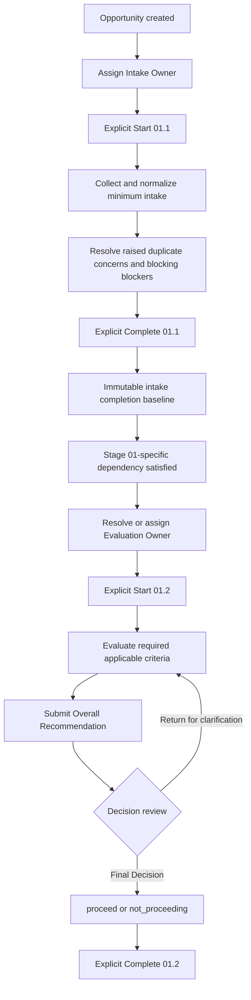

# VQH Project Journey — Stage 01 Detailed Business Design

> **Stage:** 01 — Tiếp nhận & đánh giá cơ hội
>
> **Sub-stages:** 01.1 Tiếp nhận yêu cầu; 01.2 Đánh giá cơ hội & quyết định tiếp tục
>
> **Status:** APPROVED / CONFIRMED STAGE-SPECIFIC BUSINESS DESIGN
>
> **Authority scope:** VQH Stage 01 only
>
> **Design maturity:** BUSINESS DESIGN — NOT TECHNICAL SPEC — NOT IMPLEMENTATION PLAN
>
> **Implementation authorization:** None. Approval of this document does not authorize implementation.
>
> **Approved:** 2026-08-29

## 1. Authority, purpose, and reading order

This document is the approved detailed business authority for Stage 01 of the VQH Project Journey. Read it together with the [VQH Project Journey Canonical Reference](../README.md), which remains authoritative for shared workflow semantics.

The authority chain is:

```text
VQH Project Journey — Canonical Reference
                ↓
This approved Stage 01 business design
                ↓
Future approved Technical Spec
                ↓
Future approved Implementation Plan
                ↓
Implementation
```

This document defines the VQH business baseline needed to design future domain, data, permission, audit, revalidation, and user-flow behavior. It does not define a database schema, persisted enum, API contract, UI layout, permission-to-role mapping, or implementation detail.

Approval means the Stage 01 business decisions are confirmed. It does not mean the current prototype implements them or that Stage 01 is implementation-ready.

```text
Approved business design
!= current prototype behavior
!= implementation-ready Technical Spec
```

## 2. Scope and shared-semantics boundary

This design applies only to VQH. It must not be promoted into global Taskovia workflow rules for other companies.

Stage 01 applies the shared semantics owned by the canonical reference rather than defining another workflow engine. In particular, the canonical reference remains authoritative for:

- generic `WorkflowNode` states and explicit dependency evaluation;
- requirement lifecycle and fulfillment/revocation semantics;
- blocker records and derived `blocked` state;
- controlled Start, Complete, reopen, revalidation, and current-validity semantics;
- generic node-level and requirement-level N/A semantics;
- assignment and authority separation;
- project snapshots, amendments, and template-version migration.

This document decides how Stage 01 uses those shared capabilities. It does not decide:

- whether the parent Stage is a runtime node or only a container;
- generic parent completion behavior;
- generic parent/child start gating;
- child-blocked-to-parent status propagation;
- the effect of reopening a child on a completed parent;
- N/A inheritance;
- generic hierarchy propagation or cross-Stage hierarchy boundaries.

The explicit dependency from 01.1 to 01.2 in [Section 6](#6-approved-business-flow-and-dependencies) is a Stage 01 business decision only. It must not be generalized into any of those unresolved mechanics.

## 3. Stage purpose and business boundary

Stage 01 answers two different questions:

```text
01.1 — Chúng ta đã hiểu Opportunity đủ để đánh giá chưa?

01.2 — Sau khi đánh giá, VQH có quyết định tiếp tục Opportunity này không?
```

The approved boundary is:

```text
01.1 = đủ thông tin để đánh giá
01.2 = đánh giá và quyết định
```

The two questions must not be collapsed into one approval.

Stage 01 has exactly two final business outcomes for a decision cycle:

```text
proceed
not_proceeding
```

`on_hold` and `deferred` are not final Stage 01 outcomes. Waiting for information, action, or decision is represented through the applicable shared runtime state such as `active` or `blocked`.

Business outcome remains separate from workflow state. A Stage 01 cycle may have outcome `proceed` or `not_proceeding`, while workflow completion is still an explicit controlled action.

## 4. Inputs and upstream contract

Stage 01 begins from a real or reasonably grounded potential need that VQH is allowed to register as an Opportunity. The source may be:

- a customer contacting VQH;
- a referral, referrer, or partner;
- a grounded proactive lead;
- a new need from an existing Customer;
- another valid VQH source.

There is no upstream Project Journey Stage whose completion is an input to 01.1. Creation requires the appropriate Opportunity Intake permission, but detailed technical permissions remain deferred.

An Opportunity may be created before VQH has:

- a complete or verified Customer master;
- direct confirmation from the customer;
- all minimum intake data;
- an Intake Owner;
- a Project Manager.

The minimum data is collected during 01.1. Start and completion conditions are defined separately in [Sections 12](#12-start-authority-and-start-conditions) and [13](#13-011-completion-requirements-hard-gates-and-exit).

## 5. Approved sub-stages

```text
01. Tiếp nhận & đánh giá cơ hội
├── 01.1 Tiếp nhận yêu cầu
└── 01.2 Đánh giá cơ hội & quyết định tiếp tục
```

### 5.1 01.1 — Tiếp nhận yêu cầu

01.1 creates an auditable Opportunity intake baseline that is sufficiently clear for evaluation. Completing 01.1 confirms only that the approved minimum intake set was satisfied at that time.

Completion does not mean:

- the Opportunity has been approved;
- VQH has committed to accept the project;
- all information is fully verified;
- the Customer master is complete;
- a Project Manager has been assigned.

### 5.2 01.2 — Đánh giá cơ hội & quyết định tiếp tục

01.2 evaluates a valid intake baseline through the Common VQH Evaluation Framework and records a human-controlled Final Decision of `proceed` or `not_proceeding`.

It does not use an automatic score or criterion result to decide the outcome.

## 6. Approved business flow and dependencies



The approved dependency is:

```text
01.1 Complete
→ explicit dependency satisfied
→ 01.2 may Start
```

It means 01.2 is eligible to proceed to owner resolution and explicit Start. It does not auto-start 01.2, auto-resolve an owner, or establish a generic previous-node or parent/child rule.

If 01.1 has `needsRevalidation`, or its completion is no longer valid for new progression, 01.2 must follow the shared revalidation rules before new progression is authorized.

## 7. Opportunity identity and canonical record

### 7.1 One real need, one canonical Opportunity

Each real need or potential project is represented by one canonical Opportunity. One Customer may have multiple Opportunities.

Evaluation records, decision cycles, and audit are scoped to the Opportunity. If the same real need enters through several people or channels, VQH must converge on one canonical Opportunity rather than retain several Opportunities representing the same need.

### 7.2 Duplicate handling

The system may support suspected-duplicate detection but must not auto-merge records only because their data is similar.

Once a duplicate concern is raised, it must be resolved before 01.1 can complete. Resolution may establish that:

- the records concern the same need, so they are merged/linked to the canonical Opportunity; or
- the records concern different needs, so both remain separate and the resolution is recorded.

The duplicate intake history must be retained. A duplicate concern that has never been raised is not an implied universal search requirement; the gate applies to a raised, unresolved concern.

## 8. Approved 01.1 intake business data

This section confirms business information and invariants. It does not prescribe physical columns, API fields, or hard-coded enums.

### 8.1 Primary Customer and Customer context

An Opportunity can begin with preliminary customer information and a Primary Contact before Customer-master deduplication or creation.

Each Opportunity has one Primary Customer identity. At 01.1 completion it may remain preliminary, but it must be sufficient to identify whom the Opportunity concerns. VQH must also record a minimum Customer Type/Context. The exact taxonomy is deferred.

A controlled correction or reassignment of Primary Customer must retain the old value, new value, actor, timestamp, and reason. A normalization correction does not itself reopen 01.1 when the minimum intake remains valid; a change that invalidates the completion basis uses controlled reopen/revalidation.

### 8.2 Primary Contact and relationship

The long-term model must support multiple Contacts. The 01.1 minimum requires one Primary Contact with at least one usable contact method, such as phone, email, or another supported channel. Phone and email are not both mandatory.

The relationship of the Primary Contact to the Customer or Opportunity must be recorded. Never assume:

```text
Primary Contact = Customer
```

Relationship semantics may include customer/owner, representative, customer-organization staff, authorized person, alternate contact, other, or not-yet-clear. The exact taxonomy is deferred.

Primary Contact may change through a controlled update. The old contact and relationship history remain available. Reopen is required only when the completion basis loses validity.

### 8.3 Initial scope and requirement description

An Opportunity may contain multiple scopes. At least one structured scope and one meaningful free-text description of the initial need are required for 01.1 completion.

The exact scope categories are deferred. Design, construction, renovation, and interior are examples, not final enums. A deliberate `other` or `not yet clearly classified` semantic is preferable to forcing an incorrect category.

The free-text description need not be a detailed technical brief, but another actor must be able to understand what the customer needs.

### 8.4 Project Location

An exact address is not required. The level of location knowledge must be explicit, with business semantics at least equivalent to:

- unknown;
- known area/province/city;
- relative location;
- exact address/location.

VQH must not enter a fake address merely to satisfy a gate. Later Stages may define stricter location requirements through their own approved designs.

### 8.5 Budget, timeline, and priority

Budget, timeline, and opportunity priority/heat are not 01.1 completion gates.

If budget is recorded, its context may distinguish not discussed, customer undecided, customer unwilling to disclose, or an available amount/range. If timeline is recorded, it may distinguish not discussed, unknown, relative milestone, time range, or a specific deadline. These are business examples rather than approved final enums.

Priority or heat level is operational metadata and never replaces 01.2 evaluation.

### 8.6 Primary Lead Source and Referrer

Each Opportunity has one structured Primary Lead Source. The exact source list is configurable and deferred. It may support `other + note` and a deliberate `unknown` semantic.

Primary Lead Source is not the same as later communication channels. A referral remains the source even when subsequent exchanges occur by message or in person. An initially unknown source may later be corrected with audit.

If the Primary Lead Source means referral, partner, or referrer, a minimally identifiable Referrer is conditionally required before 01.1 completion. Referrer may be an individual, organization/partner, existing Customer, VQH relationship source, or another approved type. Never assume:

```text
Referrer = Primary Contact
```

### 8.7 Engagement/contact status

At completion, engagement status must clearly express the Opportunity's confirmation/contact level, such as customer-originated, grounded basis to contact, customer reached, valid intermediary but no direct contact yet, customer-confirmed need, or not-yet-customer-confirmed need.

The exact enum is deferred. The purpose is to distinguish a grounded follow-up opportunity from a raw lead without sufficient context, not to create a complex legal consent workflow.

### 8.8 Intake Records

At least one Intake Record is required. It records how and what VQH actually received at a point in time, for example by call, message, email, meeting, referral, or another valid source. An attachment is not mandatory.

An Opportunity may have multiple Intake Records. They must not be collapsed into one note that overwrites earlier history.

After formal recording, an Intake Record is historical business evidence. Corrections use an amendment/correction or a new Intake Record, retaining actor, timestamp, reason, and any reference to the corrected record.

```text
Intake Record
= what VQH received or recorded at that time

Opportunity current data
= the current normalized information
```

These are separate record classes in business semantics. Physical representation remains a Technical Spec concern.

### 8.9 Supporting materials

Files, drawings, images, briefs, or other customer materials are optional in 01.1. When present, they may be linked to the Opportunity or Intake Record.

```text
file exists != requirement fulfilled
```

Later approved Stage designs may require particular materials.

### 8.10 Verification context

Important data must be capable of carrying verified/confirmed versus unverified context without forcing a verification workflow on every field.

Verification status is not a universal 01.1 gate. A referral Opportunity can complete with unverified data when the minimum intake set is present and its reliability status is accurately recorded.

## 9. Historical intake, current data, and completion baseline

The following three concerns are distinct:

```text
Historical Intake Records
!= current Opportunity data
!= immutable 01.1 completion baseline
```

At explicit 01.1 completion, VQH retains an immutable baseline snapshot or reference containing only what is needed to reconstruct:

- the minimum intake set used at completion;
- the requirement fulfillment that directly satisfied completion;
- the evidence/reference needed to explain why completion was valid.

The snapshot does not need to duplicate the entire Opportunity. It may reference already-immutable Intake Records.

Current Opportunity data may later be enriched or corrected, including clearer location, budget, timeline, a valid Primary Contact change, or Primary Customer normalization. Those changes do not automatically reopen 01.1. Appropriate history must still show completion-time data, actor, time, and important before/after values.

The governing invariant is:

```text
current Opportunity data != immutable intake completion baseline
```

## 10. Ownership and contributors

### 10.1 Creator

Creator is the actor who creates the Opportunity. Creator is an immutable audit fact and is not automatically the Intake Owner.

### 10.2 Intake Owner

Each 01.1 has one primary Intake Owner accountable for a complete intake. The Opportunity may be created before an owner is assigned, but an Intake Owner is required before 01.1 Start and Complete.

Controlled reassignment retains the old owner, new owner, actor, timestamp, and reason when policy requires it. The system must be able to identify the Intake Owner at the time of 01.1 completion.

### 10.3 Contributors

01.1 may have multiple Contributors deliberately assigned at the 01.1 scope. A 01.1 Contributor is not automatically a contributor to the entire Opportunity or a later Stage and may perform only permitted actions. Contributor does not imply Completion Authority.

### 10.4 Evaluation Owner

Evaluation Owner is accountable for evaluating the Opportunity against the Common VQH Evaluation Framework. Evaluation Owner is a separate authority concern from Decision Authority and Completer, even when policy allows the same actor to hold more than one authority.

## 11. Authority and approval model

Stage 01 must preserve separate business capabilities rather than assume one role owns every action.

For 01.1 these include Creator, Viewer, Editor, Starter, Completer, Intake Owner, Contributor, duplicate-concern resolver, Invalidate Authority, Restore Authority, and shared Reopen/Revalidation and Blocker Resolution authorities.

For 01.2 these include Evaluation Owner, criterion evaluator, Recommendation submitter, Decision Authority, clarification-return authority, Starter, Completer, and shared Reopen/Revalidation and Blocker Resolution authorities.

The following are not equivalent by default:

```text
ownership != edit permission
edit permission != Completion Authority
view permission != edit permission
Creator != Intake Owner
Intake Owner != hard-coded Completer
Evaluation Owner != Decision Authority != Completer
```

VQH's current default policy allows the Intake Owner to complete 01.1 when RBAC permits. No second-person approval is required for 01.1. This is a current policy, not a hard-coded domain invariant.

Decision Authority is resolved through a VQH authority-resolution rule, not a fixed named person in the workflow definition. A future detailed rule may consider Opportunity type, scope, risk level, management structure, or another approved business condition. Evaluation can occur before the concrete Decision Authority is fully resolved, but Final Decision cannot occur until it is resolved. Detailed resolution rules and permission-to-role mapping remain deferred.

## 12. Start Authority and start conditions

Start is an explicit audited action under the shared workflow semantics.

### 12.1 Start 01.1

01.1 is always applicable for a valid VQH Opportunity. Its minimum start condition is:

```text
Opportunity exists
+ Intake Owner assigned
+ actor has Starter permission
→ explicit Start 01.1
```

Customer, Contact, Scope, Location, Lead Source, and other completion data are gathered during 01.1 and are not additional start gates.

### 12.2 Start 01.2

```text
valid 01.1 Complete
+ Evaluation Owner resolved/assigned
+ actor has Starter permission
→ explicit Start 01.2
```

01.1 completion makes 01.2 eligible; it does not auto-start 01.2. A prerequisite validity or revalidation issue prevents new progression under the shared rules.

## 13. 01.1 completion requirements, hard gates, and exit

01.1 completion is an explicit action by an actor with Completion Authority. Data sufficiency never auto-completes the node.

### 13.1 Required business minimum

All of the following are required at completion:

- the Opportunity is valid and not invalidated;
- an Intake Owner is assigned;
- preliminary Primary Customer identity sufficient to identify whom the Opportunity concerns;
- Customer Type/Context;
- one Primary Contact;
- at least one usable contact method for the Primary Contact;
- Primary Contact relationship to the Customer or Opportunity;
- at least one structured scope;
- a meaningful free-text description of the need;
- Project Location status;
- Primary Lead Source;
- engagement/contact status;
- at least one Intake Record;
- no open blocking blocker;
- no raised suspected-duplicate concern left unresolved.

### 13.2 Conditional requirement

When Primary Lead Source means referral, partner, or referrer, a minimally identifiable Referrer is required.

Other conditional requirements require a future controlled amendment to the Stage 01 design; they must not be invented during implementation.

### 13.3 Optional and non-gating in 01.1

The following are not 01.1 completion gates:

- budget amount, range, or status;
- exact start date or deadline;
- timeline status/value;
- priority or heat level;
- supporting files/documents;
- a fully verified Customer master;
- every item being verified;
- Project Manager assignment.

### 13.4 01.1 exit and output

Successful explicit completion produces:

- a historically valid 01.1 completion event;
- an immutable minimum-intake completion baseline or reference;
- an Opportunity eligible for the explicit 01.1-to-01.2 dependency;
- audit sufficient to explain the completion basis.

It does not produce a `proceed` decision.

## 14. Common VQH Evaluation Framework

Every Opportunity uses one Common VQH Evaluation Framework as a baseline. The framework contains required, optional, and contextually conditional criteria. VQH may add a relevant criterion for an Opportunity, but the evaluation must not become free-form in a way that loses the common baseline.

The approved baseline has five dimensions.

### 14.1 Khách hàng & nhu cầu

Evaluate the clarity, reality, confirmation level, reliability, missing information, and relevant concerns around the customer and need.

### 14.2 Phạm vi & khả năng chuyên môn

Evaluate preliminary fit with VQH's capabilities, special technical requirements, known capability limits, and whether partners or additional capability may be needed.

### 14.3 Nguồn lực & tiến độ

Evaluate preliminary resource availability, workload, desired timeline, urgency, and any known deadline.

### 14.4 Khả năng thương mại

Evaluate commercial fit at the time of review. Known budget may be an input, but missing budget does not automatically prevent evaluation and never automatically decides the outcome.

### 14.5 Rủi ro & điều kiện đặc biệt

Evaluate known Opportunity-level customer, location, legal, technical, payment, and other unusual concerns. Stage 01 evaluation is preliminary and does not replace detailed risk management in later Stages.

Detailed criteria inside each dimension and the detailed risk taxonomy remain deferred.

## 15. Criterion requirements, verification, and N/A

Each evaluated criterion records:

- a structured result; and
- suitable rationale and/or evidence.

The exact result enum is deferred, but it must be able to represent semantics equivalent to favorable/fit, concern/risk, not fit, insufficient information, and `not_applicable` where N/A is permitted.

```text
criterion evaluated != criterion passed
unfavorable criterion != automatic not_proceeding
```

Every required applicable criterion must be evaluated before Final Decision. Optional criteria do not gate completion. A conditional criterion becomes required only when its approved applicability condition is satisfied.

`Insufficient information` must not be used to pretend a required criterion is complete when Evaluation Owner still needs information before Recommendation.

Criterion N/A is allowed only where that criterion permits it and must use the shared controlled requirement-level N/A semantics.

At node level, 01.1 is always applicable to a valid Opportunity. This Stage design does not introduce a special node-level N/A shortcut for 01.2 or a generic parent/child N/A inheritance rule. Invalid intake follows [Section 19](#19-invalid-intake), not N/A.

## 16. Recommendation, clarification, and Final Decision

### 16.1 Overall Recommendation

After evaluation is sufficient, Evaluation Owner submits a formal Overall Recommendation with rationale/evidence:

```text
recommend_proceed
recommend_not_proceeding
```

```text
Recommendation != Final Decision
```

Recommendation does not change the business outcome by itself.

### 16.2 Return for clarification or re-evaluation

Decision Authority may return the Opportunity for clarification/re-evaluation within the same decision cycle:

```text
Evaluation completed
→ Recommendation submitted
→ Decision review
   ├─ Final Decision
   └─ Return for clarification
        → clarify or re-evaluate
        → submit a new Recommendation
        → Decision review again
```

Return for clarification is not a final outcome, does not create `not_proceeding`, does not create a new Opportunity or decision cycle, and does not end 01.2. Prior Recommendations and the return reason remain in history.

### 16.3 Final Decision

Only the resolved Decision Authority may record Final Decision. The record contains at least:

- `proceed` or `not_proceeding`;
- Decision Authority;
- timestamp;
- rationale;
- the Recommendation on which the decision was based.

An override rationale is mandatory when Final Decision differs from the Recommendation. No score or criterion result may auto-decide the outcome.

The 01.2 Final Decision is the single canonical Stage 01 business outcome of that decision cycle. Stage 01 must not create a second synchronized `proceed/not_proceeding` decision.

```text
Recommendation != Final Decision
Final Decision != workflow Complete
```

## 17. 01.2 completion, exit criteria, and downstream contract

Final Decision does not auto-complete 01.2. Explicit completion requires:

- every required applicable criterion evaluated;
- the current Overall Recommendation submitted;
- Final Decision `proceed` or `not_proceeding` recorded by Decision Authority;
- no open blocking blocker;
- no prerequisite/revalidation issue invalidating new progression;
- an authorized explicit Complete action.

Optional unevaluated criteria do not block completion.

Completion outputs are:

- the canonical decision-cycle outcome;
- complete evaluation, Recommendation, clarification, and Final Decision history;
- explicit 01.2 completion audit;
- a retained Opportunity and Journey record regardless of outcome.

`proceed` may serve as business input for downstream Project Journey progression. This Stage document does not approve a dependency or start rule for Stage 02 or any later Stage.

`not_proceeding` means a valid Opportunity was evaluated and VQH decided not to continue in this cycle. It does not delete the Opportunity, remove it from Journey history, or make it invalid.

## 18. Blockers and exceptional paths

### 18.1 Missing required information is not automatically blocked

```text
required information missing
→ not yet completable

open blocking blocker
→ node derives blocked under shared semantics
```

A real blocking blocker may include an inability to reach the contact for required information, a duplicate concern awaiting resolution, an ownership/permission problem preventing continued work, or another business obstacle needing resolution.

Blocker records, responsible party, Resolution Authority, and derived state follow the canonical shared model. Stage 01 does not define a separate blocker engine or lock an exact blocker taxonomy.

### 18.2 Unverified information

Unverified data is not automatically invalid and does not automatically block 01.1 completion when the approved minimum is otherwise satisfied and reliability is accurately recorded.

### 18.3 Supporting files

Missing files do not block 01.1 because files are optional there. A later approved requirement may govern a specific material under its own Stage design.

### 18.4 Clarification during 01.2

Clarification/re-evaluation stays within the same decision cycle and preserves all previous Recommendations and return reasons.

## 19. Invalid intake

```text
invalid intake != not_proceeding
```

Invalid applies when the record is not a valid business Opportunity, such as creation by mistake, spam/test, fake, a duplicate merged into the canonical Opportunity, or confirmation that no real opportunity exists.

`not_proceeding` applies only to a valid Opportunity that completed evaluation and received that business decision in 01.2.

Invalidation is a controlled action requiring separate authority, a structured reason with optional note, actor, timestamp, and audit. The exact reason enum is deferred. Creator, Intake Owner, and Completer do not automatically have Invalidate Authority.

An Opportunity may be invalidated after 01.1 completion if later evidence shows it was never a valid Opportunity. Existing downstream runtime history is retained.

Controlled restore retains all invalidate/restore history and requires separate Restore Authority. A record invalidated as `duplicate_merged` is not automatically restored as an independent Opportunity without an explicit separation/correction decision.

## 20. Reopen and revalidation impacts

Current-data enrichment does not automatically reopen 01.1. Controlled reopen/revalidation is required when information or evidence that satisfied the minimum intake basis is later found invalid, for example:

- the completion-basis Primary Contact is not actually contactable;
- a material duplicate concern emerges;
- the baseline scope is seriously wrong;
- an Intake Record/evidence used for completion is invalid.

The current data must not be silently edited to repair historical truth. Shared reopen/revalidation semantics apply:

- historical completion remains recorded;
- current validity is tracked separately;
- downstream history is not automatically rolled back;
- a prerequisite needing revalidation cannot authorize new progression;
- affected new progression follows `needsRevalidation` until controlled revalidation succeeds.

This section applies shared behavior to Stage 01 and does not decide generic parent/child reopen mechanics.

## 21. Decision cycles and controlled reactivation

Each complete business consideration has a separate decision-cycle identity containing its own evaluation records, criterion results, Recommendation history, clarification returns, Final Decision, actors, timestamps, and rationale.

A completed cycle is never overwritten. A current view may point to the latest cycle while every earlier cycle remains independently reconstructable.

If the same valid Opportunity returns after `not_proceeding`, use controlled reactivation:

```text
Decision Cycle 1
01.2 → not_proceeding

same Opportunity returns later
        ↓
controlled reactivation
        ↓
check current intake validity
        ↓
Decision Cycle 2
01.2 → evaluate again → new Recommendation → new Final Decision
```

Reactivation does not automatically rerun 01.1. If the existing intake baseline remains valid, the new cycle may begin at 01.2 subject to its normal owner, Start, and gate rules. If it is no longer valid, 01.1 follows controlled reopen/revalidation first.

```text
reactivation != overwrite previous decision cycle
```

## 22. Audit expectations

Stage 01 audit must allow VQH to reconstruct important business history without relying on current mutable values alone.

For Opportunity creation and intake, retain at least:

- creator and creation timestamp;
- Intake Owner assignment/reassignment history;
- Contributor assignment history;
- important structured-data changes;
- Primary Customer correction history;
- Primary Contact change history;
- Lead Source correction history;
- Intake Records and correction history;
- duplicate concerns and resolutions;
- invalidation and restore events;
- blocker lifecycle;
- 01.1 Start and Complete actions;
- the immutable completion-baseline snapshot/reference.

For evaluation and decision, retain at least:

- Evaluation Owner;
- criterion results and rationale/evidence;
- Recommendation versions;
- clarification-return events and reasons;
- resolved Decision Authority;
- Final Decision and any required override rationale;
- 01.2 Start and Complete actions;
- reopen and revalidation events;
- decision-cycle history;
- reactivation history.

VQH currently uses the Opportunity's Taskovia creation timestamp as the official system intake time. A separate business `receivedAt` is not approved in this design; introducing it later requires a controlled business amendment.

## 23. Open and intentionally deferred issues

The following configuration remains intentionally deferred and must not become hard-coded global enums or assumed implementation rules:

- exact Customer Type taxonomy;
- exact Primary Contact relationship taxonomy;
- exact Scope categories;
- exact Lead Source list;
- exact Referrer type taxonomy;
- exact engagement status enum;
- exact invalid reason enum;
- exact evaluation criterion result enum;
- detailed criteria inside each evaluation dimension;
- detailed authority-resolution rules;
- detailed conditional applicability rules;
- detailed risk taxonomy;
- exact permission-to-role mapping.

The following technical matters are also not approved by this business design:

- physical database schema and migration order;
- persisted/API field names and enums;
- API contracts;
- permission implementation and exact role mapping;
- UI and interaction design;
- Technical Spec, Implementation Plan, and test design.

Generic parent/child mechanics listed in [Section 2](#2-scope-and-shared-semantics-boundary) remain unresolved in the canonical shared design. No prototype structure may be used to fill those gaps.

## 24. Business invariants

An implementation and future Technical Spec must preserve these boundaries:

```text
one real need → one canonical Opportunity
Primary Contact != Customer by default
Referrer != Primary Contact by default
Creator != Intake Owner by default
Intake Owner != hard-coded Completer
missing required data != blocked
file exists != requirement fulfilled
unverified data != automatically invalid intake
invalid intake != not_proceeding
current Opportunity data != immutable intake completion baseline
criterion evaluated != criterion passed
unfavorable criterion != automatic not_proceeding
Recommendation != Final Decision
Final Decision != workflow Complete
return for clarification != final outcome
not_proceeding != delete Opportunity
reactivation != overwrite previous decision cycle
```

## 25. Stage decision registry

All decisions below are scoped to VQH Stage 01. Decisions `VQH-S01-001` through `VQH-S01-012` preserve the existing canonical history; the approved detailed design refines them without renumbering or silently changing their meaning. New substantive decisions continue from `VQH-S01-013`.

| ID | Decision | Status | Consequence in Stage 01 |
| --- | --- | --- | --- |
| VQH-S01-001 | Non-proceeding Opportunity remains in Journey | CONFIRMED | Preserve the Opportunity and its decision history. |
| VQH-S01-002 | Business outcome is separate from workflow status | CONFIRMED | `proceed`/`not_proceeding` and workflow completion remain separate concerns. |
| VQH-S01-003 | Approved Stage breakdown | CONFIRMED | Use 01.1 intake then 01.2 evaluation/decision without inferring generic hierarchy mechanics. |
| VQH-S01-004 | Controlled business decision | CONFIRMED | Separate evaluation, Recommendation, Final Decision, and workflow completion actions and authorities. |
| VQH-S01-005 | Minimum intake set | CONFIRMED | Use the approved business minimum in Section 13; physical schema and API naming remain deferred. |
| VQH-S01-006 | PM not required at initial intake | CONFIRMED | Intake accountability does not require Project Manager assignment. |
| VQH-S01-007 | PM assignment is not Stage 01 exit gate | CONFIRMED | Stage 02 staffing/startability requires its own approved governance. |
| VQH-S01-008 | Only two final outcomes | CONFIRMED | Use `proceed` or `not_proceeding`; waiting uses workflow state. |
| VQH-S01-009 | Structured evaluation | CONFIRMED | Use the Common VQH Evaluation Framework and human Decision Authority; do not auto-score outcome. |
| VQH-S01-010 | Required / optional / conditional criteria | CONFIRMED | Evaluate every required applicable criterion; `evaluated != passed`. |
| VQH-S01-011 | Controlled reactivation | CONFIRMED | Reactivate the same valid Opportunity with authority, reason, timestamp, and audit. |
| VQH-S01-012 | Immutable decision cycles | CONFIRMED | Preserve each reconsideration cycle and all prior decisions. |
| VQH-S01-013 | Canonical Opportunity and duplicate resolution | CONFIRMED | Represent one real need with one canonical Opportunity; resolve raised duplicate concerns before 01.1 completion and retain history. |
| VQH-S01-014 | Historical Intake Records versus current data | CONFIRMED | Keep Intake Records and the completion basis reconstructable while current data evolves separately. |
| VQH-S01-015 | Explicit 01.1 start and completion governance | CONFIRMED | Require Intake Owner and authorized explicit Start/Complete; do not auto-complete or require second-person approval. |
| VQH-S01-016 | Approved 01.1 business completion set | CONFIRMED | Gate on the approved required and conditional minimum without turning optional budget, timeline, files, verification, or PM assignment into gates. |
| VQH-S01-017 | Invalid intake lifecycle | CONFIRMED | Invalidate/restore non-Opportunity records through controlled audit, separate from `not_proceeding`. |
| VQH-S01-018 | Explicit 01.1-to-01.2 dependency | CONFIRMED | Valid 01.1 completion permits owner resolution and explicit 01.2 Start; this is not a generic hierarchy rule. |
| VQH-S01-019 | Common evaluation framework and five dimensions | CONFIRMED | Use the common baseline for customer/need, capability, resources/schedule, commercial viability, and risk/special conditions. |
| VQH-S01-020 | Criterion result and gate semantics | CONFIRMED | Record structured result and rationale/evidence; only required applicable evaluation is gating, and adverse results do not decide outcome. |
| VQH-S01-021 | Recommendation and clarification loop | CONFIRMED | Keep Recommendation separate from Final Decision and preserve clarification returns and Recommendation versions within the same cycle. |
| VQH-S01-022 | Final Decision and canonical Stage outcome | CONFIRMED | Decision Authority records the one `proceed`/`not_proceeding` outcome per cycle; override needs rationale and does not auto-complete workflow. |
| VQH-S01-023 | Explicit 01.2 completion governance | CONFIRMED | Separate Evaluation Owner, Decision Authority, and Completer; explicitly complete only after all current gates pass. |
| VQH-S01-024 | Post-completion updates and intake revalidation | CONFIRMED | Enrich current data without rewriting the completion baseline; reopen/revalidate when its basis loses validity. |
| VQH-S01-025 | Reactivation starts a new consideration cycle | CONFIRMED | Reuse the same valid Opportunity, check intake validity, and never overwrite a prior cycle. |
| VQH-S01-026 | Reconstructable Stage 01 audit | CONFIRMED | Retain ownership, intake, evaluation, decision, blocker, validity, and reactivation history. |

## 26. Stage documentation contract coverage

| Required concern | Location in this document |
| --- | --- |
| Stage purpose | Sections 1 and 3 |
| Inputs and upstream contract | Section 4 |
| Approved sub-stages | Section 5 |
| Business flow | Section 6 |
| Dependencies | Section 6 |
| Requirements and hard gates | Sections 13, 15, and 17 |
| Ownership | Section 10 |
| Approvals and verification | Sections 8.10, 11, and 16 |
| Start Authority | Section 12 |
| Completion Authority | Sections 11, 13, and 17 |
| Exit criteria | Sections 13.4 and 17 |
| Outputs and downstream contract | Sections 13.4 and 17 |
| Blockers and exceptional paths | Sections 18 and 19 |
| N/A behavior | Section 15 |
| Reopen and revalidation impacts | Section 20 |
| Audit expectations | Sections 9 and 22 |
| Open/deferred issues | Section 23 |
| Stage decision registry | Section 25 |

## 27. Handoff boundary

The next work, if separately approved, follows this order:

```text
Stage 01 Detailed Business Design — APPROVED
        ↓
Technical Spec
        ↓
Implementation Plan
        ↓
Implementation tasks
```

This documentation task stops at the approved business-design baseline. It does not begin or authorize any Technical Spec, Implementation Plan, schema, backend, API, frontend, permission, migration, or test work.
